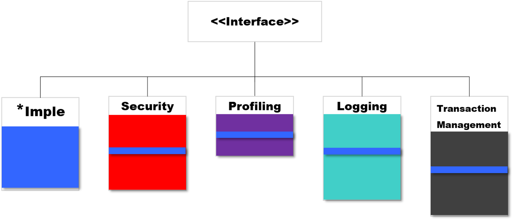

# AOP란 무엇일까
## Spring AOP 개념
- AOP는 Aspect Oriented Programming의 약자로 관점 지향 프로그래밍이라고도 한다.
  - 관점은 코드를 바라보는 시각 정도로 생각할 수 있다.
- 관점 지향 프로그래밍은 기능을 구현할 때 핵심적인 기능과 부가적인 기능을 분리하여 각 관점(Aspect)을 기준으로 모듈화하는 방식을 의미한다.
```
핵심적인 기능: 적용하고자 하는 비즈니스 로직
부가적인 기능: 데이터베이스 연결 및 트랜잭션 관리, 로깅, 파일 입출력 등
```

<p align="center"></p>

- AOP에서 각 관점을 기준으로 모듈화를 한다는 것은 코드들을 부분적으로 나누어서 모듈화를 한다는 의미이다.
- 위 그림과 같이 코드에서 다른 부분에 반복적으로 사용되는 코드들을 발견할 수 있는데, 이를 __횡단 관심사(Crosscutting Concerns)__ 라고 한다.

- 위 그림에서 모든 클래스에 공통적으로 사용되고 있는 주황색 기능을 수정해야 하는 일이 발생하면 A, B, C 모든 클래스에서 기능을 수정해주어야 하기 때문에 유지보수면에서도 효율적이지 않다.
- 이러한 문제점을 해결하기 위해 나온 기술이 AOP로, 정리해보자면 다음과 같다.
```
'횡단 관심사(Crosscutting Concerns)의 분리를 허용함으로써 모듈성을 증가시키는 것이 목적인 프로그래밍 패러다임'
```
- AOP는 결국 애플리케이션을 다양한 측면에서 독립적으로 모델링하고, 설계하고, 개발할 수 있도록 만들어 주고, 그로 인해 애플리케이션을 다양한 관점에서 바라보며 개발할 수 있게 도와준다.

 
## 예시
- 아래는 은행 애플리케이션을 관심사라는 관점으로 표현한 구조이다.
<p align="center"></p>

- 위 은행 애플리케이션 구조는 각 핵심 기능들(계좌이체, 입출금, 이자계산)이 수행될 때 마다 부가적인 기능들(로깅, 트랜잭션, 보안)이 이루어져야 한다.
- 즉, 계좌이체의 관점에서도 로깅, 트랜잭션, 보안을 수행해야 하고 입출금, 이자계산의 관점에서도 동일하게 로깅, 트랜잭션, 보안 기능을 수행해야 한다.
- 위 구조에서 핵심 기능들을 수행하는데 반드시 실행하는 공통적인(부가적인) 기능들이 __로깅, 트랜잭션, 보안__ 이다.
  - 이러한 것들을 횡단관심이라고 하는데, 왜 이러한 부가 기능을 분리해야 하는걸까?
  - 당연하게도, 중복이 발생한다는 문제점과 유지보수의 어려움이 있기 때문이다.

### 문제점
- 간단한 pseudocode를 통해 문제점에 대해 살펴보자.
```java
class 로그 {
  static printLog();
}

class 계좌이체 {
  이체() {
    로그.printLog();
    ...
  }
}

class 입출금 {
  입금() {
    로그.printLog();
    ...
  }
}

class 이자계산 {
  이자계산() {
    로그.printLog();
    ...
  }
}
```
- 위 예제에서 로그를 출력하는 printLog()의 메소드명이 변경되었다면 어떻게 해야할까?
- 다음과 같이 로그를 사용하고 있는 모든 클래스 및 메소드를 찾아가 변경해야 하는 일이 발생한다.

```java
class 로그 {
  static printLog4j();
}

class 계좌이체 {
  이체() {
    로그.printLog4j();
    ...
  }
}

class 입출금 {
  입금() {
    로그.printLog4j();
    ...
  }
}

class 이자계산 {
  이자계산() {
    로그.printLog4j();
    ...
  }
}
```

- 현재는 로그 기능을 사용하고 있는 클래스가 3개밖에 존재하지 않지만, 만약 로그 기능을 사용하고 있는 클래스가 점차 늘어나 3개가 아닌 30개, 100개가 된다면?
  - 위와 같이 수정사항이 발생했을 때 모든 클래스에 직접 수정을 해주어야 하는 번거로움이 발생한다.
- 따라서 스프링 AOP를 통해 관심사를 분리하고 이러한 문제점을 해결해보도록 하자.

## OOP로도 반복을 줄일 수 있지 않을까?
- 비즈니스 기능과는 별개의 영역이지만, 필연적으로 대다수의 비즈니스 기능에 분포되어 있는 횡단 관심사를 추상화와 디자인 패턴을 사용하여, 기존 클래스에서 횡단 관심사와 핵심 관심사를 분리할 수 있다.
- 예를 들어, 트랜잭션 기능(횡단 관심사)과 비즈니스 기능(핵심 관심사)이 하나의 클래스에 공존하고 있는 UserService 클래스가 있다고 가정하자.
  - 이 때, 먼저 해야 할 일은 기존 클래스를 특수화하여 횡단 관심사와 핵심 관심사를 분리하는 것이다.

<p align="center"></p>

- 설계적 측면으로 UserService 인터페이스 아래에 구현 클래스인 UserServiceImple(핵심 관심사), UserServiceTX(횡단 관심사)를 둘 수 있다.

```java

public interface UserService {

    void addUser(User user);

    void upgradeLevels();
}

public class UserServiceImple implements UserService {

    private UserRepository userRepository;

    public void upgradeLevels() {
        List<User> users = userRepository.findAll();
        for (User user : users) {
            upgradeLevel(user); // 이미 정의되어 있다고 가정
        }
    }

    public void addUser(User user) {
        userRepository.save(user);
    }
}

public class UserServiceTX implements UserService {

    private UserService userService;

    public void upgradeLevels() {
        // 트랜잭션 시작
        userService.upgradeLevels(); // 모든 기능을 구현 객체에 위임.
        // 트랜잭션 종료
    }
}
```

- 횡단 관심사는 트랜잭션 기능을 핵심 관심사 앞뒤에 배치를 하였고, 핵심 관심사는 유연한 확장을 위해 UserService 인터페이스에 위임한다.

<p align="center"></p>

- 그림으로 보면 위와 유사하다. 다만, 기능의 명세를 나타내는 UserService 인터페이스의 upgradeLevels()는 구현 객체인 UserServiceImpl에 위임해 주어야 하므로 기존의 의존 관계를 다음과 같이 변경해야 한다.

```
UserService -> UserServiceTX -> UserServiceImple
```

- 즉, UserService에 존재하는 UserServiceTX를 DI 하고, UserServiceTX에 존재하는 UserServiceImple를 DI 하여 의존 관계를 형성해야 한다.
- 의존 관계를 재정의함으로써 기존 프로세스에 따라 비즈니스 기능 호출 시, 트랜잭션이 결합한 기능이 호출된다.

```java
public abstract class UserService {

    @Autowired
    private UserServiceTX userServiceTX;

    public abstract upgradeLevels();

    public abstract addUser();

    // 부가 기능을 접목한 메소드
    public void upgradeLevelsWithTransaction() {
        userServiceTX.upgradeLevels();
    }
}

public class UserServiceTX implements UserService {

    @Autowired
    private UserServiceImple userServiceImple;

    public void upgradeLevels() {
        // 트랜잭션 시작
        userService.upgradeLevels(); // 모든 기능을 구현 객체에 위임.
        // 트랜잭션 종료
    }
}

public class UserServiceImple implements UserService {

    private UserRepository userRepository;

    public void upgradeLevels() {
        List<User> users = userRepository.findAll();
        for (User user : users) {
            upgradeLevel(user); // 이미 정의되어 있다고 가정
        }
    }

    public void addUser(User user) {
        userRepository.save(user);
    }
}   
```
- 위와 같이 간단한 템플릿 메소드 패턴으로 변경이 가능하다. 물론 데코레이터 패턴이나 프록시 패턴을 사용하여 추상 클래스가 아닌 인터페이스 단계로도 구현할 수 있다.
- 하지만 특정 메소드만 횡단 관심사를 적용하고 싶고, 아니면 트랜잭션 외에 다른 횡단 관심사를 추가로 적용하고 싶다면, 추상화의 본질적인 장점과는 다르게 많은 추상 클래스나 인터페이스가 생기게 되고 오히려 이를 관리하는데 큰 비용이 든다.

<p align="center"></p>

- 따라서 분리된 횡단 관심사는 따로 모듈 형태로 만들어서 설계하고 개발하는 것이 좋다. 결국 AOP는 OOP의 기술적인 한계를 극복하고자 고안된 기술이다.

<p align="center"></p>
 

## 🎯 Spring AOP 특징
- AOP(Aspect Oriented Programming)는 위에서 본 것처럼 프로그램 구조에 대한 또 다른 사고방식을 제공하여 OOP를 보완한다.
- OOP에서 모듈화의 핵심 단위는 클래스(역할)이고, AOP에서는 모듈화 단위가 Aspect(관점)이다.
- Aspect는 여러 유형과 객체에 걸쳐있는 동일한 관심사(ex. 트랜잭션)의 모듈을 가능하게 한다.
- 스프링 빈에만 AOP를 적용할 수 있다.
 
## 🎯 Spring AOP 용어 
### 핵심 관심사 영역
<p align="center"></p>

#### 타겟(Target)
- 부가기능을 부여할 대상을 의미한다. 
- 위 예시의 구조에서는 핵심기능(계좌이체, 입출금, 이자계산)을 담은 클래스를 의미한다.

#### 조인 포인트(Join Point)
- 어드바이스가 적용될 수 있는 위치를 의미한다.
- 스프링 AOP에서는 메소드 조인포인트만 제공하고 있다.
- 따라서, 스프링 프레임워크 내에서의 조인포인트는 메소드를 가리킨다고 생각해도 무방하다.

### 횡단 관심사 영역
<p align="center"></p>

#### 애스펙트(Aspect)
- OOP의 클래스와 마찬가지로 애스펙트는 AOP의 기본 모듈이다.
- 애스펙트는 부가기능을 정의한 어드바이스와 어드바이스를 어디에 적용할지 결정하는 포인트컷의 조합으로 구성된다.
- 보통 싱글톤 형태의 오브젝트로 존재한다.

#### 어드바이스(Advice)
- 실질적으로 부가기능을 담은 구현체를 의미한다.
- 어드바이스의 경우 타겟 오브젝트에 종속되지 않기 때문에 순수하게 부가기능에만 집중할 수 있다.

#### 포인트컷(PointCut)
- 부가기능이 적용될 대상(메소드)를 선정하는 방법을 의미한다.
- 스프링 AOP의 조인 포인트는 메소드의 실행이므로 스프링의 포인트컷은 메소드를 선정하는 기능을 갖고 있다.
- 따라서 포인트컷의 표현식은 메소드의 실행이라는 의미인 execution으로 시작하고, 메소드의 시그니처를 비교하는 방법을 주로 이용한다.
<p align="center"></p>

### 그 외
#### 프록시(Proxy)
- 클라이언트와 타겟 사이에 투명하게 존재하여 부가기능을 제공하는 오브젝트
- DI를 통해 타겟 대신 클라이언트에게 주입되며, 클라이언트의 메소드 호출을 대신 받아 타겟에 위임해주며 부가기능을 부여한다.

#### 인트로덕션(Introduction)
- 타겟 클래스에 추가적인 메소드나 필드를 추가하는 기능을 의미

#### 위빙(Weaving)
- 어드바이스를 핵심 로직 코드에 적용하는 것을 의미


