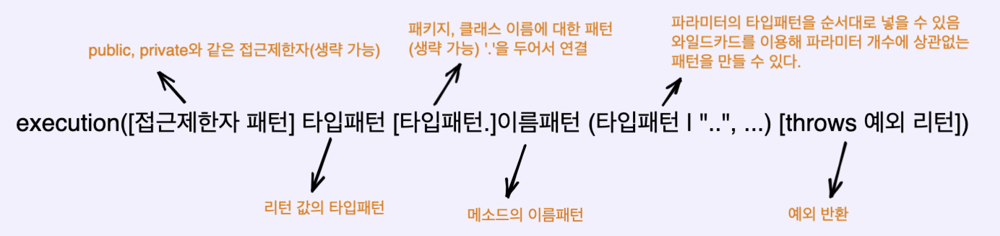

# Spring AOP 어노테이션
- Spring AOP에서 사용되는 여러 어노테이션(@Aspect, @Component, @Pointcut, @Before, @After 등)에 대해 알아보자.
 
## @Aspect, @Component
- 해당 클래스가 Aspect를 나타내는 클래스를 명시하고, 스프링 빈으로 등록하기 위해 @Component 어노테이션을 명시합니다.

## @Pointcut (포인트컷 표현식)
- 포인트컷은 위에서 부가기능이 적용될 대상(메소드)를 선정하는 방법이다.
- 포인트컷 표현식의 문법구조는 다음과 같다.
<p align="center"></p>

- [] 괄호는 옵션이기 때문에 생략이 가능하며, | 는 OR 조건이다.

### 예시 
```java
// controller 패키지의 하위 메소드를 모두 Aspect로 설정
@Pointcut("execution(* com.juhyun.springaop.aop.controller..*.*(..))")
```
- 위 문법을 해석해보자면 다음과 같다.

```
execution: 포인트컷 지정자
*: 모든 타입의 리턴이 가능
com.~.controller..*.*: (타겟이 되는 메소드) 해당 패키지 하위에 존재하는 모든 메소드들
(..): 모든 타입의 파라미터에 대해 허용하는 조건
```

- 만약 RestApiController 클래스 하위에 존재하는 get() 메소드만 부가기능을 적용할 대상으로 선정하려고 하면 다음과 같이 지정하면 된다.
```java
// RestApiController 클래스 하위의 get 메소드를 Aspect로 지정
@Pointcut("execution(* com.juhyun.springaop.aop.controller.RestApiController.get(..))")
```

### 그 외 예시
- execution(int minus(int, int)): int 타입의 리턴 값, minus라는 메소드, 두 개의 int 파라미터를 가지는 메소드
- execution(* minus(int, int)): 모든 타입의 리턴, minus라는 메소드, 두 개의 int 파라미터를 가지는 메소드
- execution(* minus(..)): 리턴 타입, 파라미터 종류, 개수에 상관없이 minus라는 메소드 이름을 가진 모든 메소드
- execution(* minus()): 리턴 타입은 상관없이 파라미터가 존재하지 않는 minus 메소드
- execution(* *(..)): 리턴 타입, 파라미터, 메소드 이름에 상관없이 모든 조건을 허용하는 포인트컷 표현식
- execution(* com.juhyun.aop.Target.*(..)): com.juhyun.aop 패키지의 Target 클래스에 존재하는 메소드
- execution(* com.juhyun.aop.*.*(..)): com.juhyun.aop 패키지에 존재하는 모든 클래스
 
## @Before
- 타겟 메소드가 실행하기 이전 어드바이스 기능을 수행

## @After
- 타겟 메소드의 결과에 상관없이 실행 후 어드바이스 기능을 수행

## @AfterReturning
- 타겟 메소드가 정상적으로 결과값을 반환 후 어드바이스 기능을 수행

## @AfterThrowing
- 타겟 메소드가 수행 중 예외를 발생하면 어드바이스 기능을 수행

## @Around
- 어드바이스가 타겟 메소드를 감싸서 타겟 메소드 호출전, 후 어드바이스 기능을 수행
- Around는 타겟을 실행할지 혹은 바로 반환할지도 정할 수 있음


