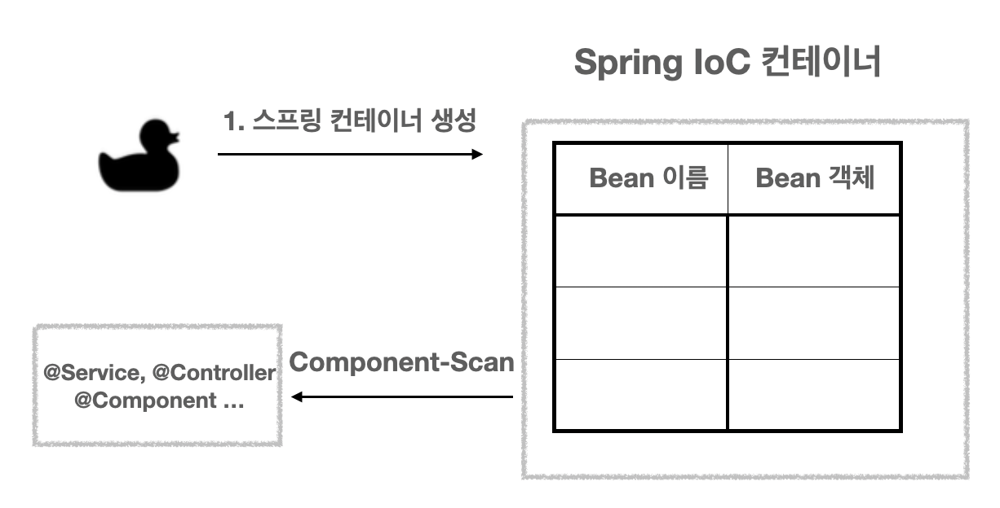
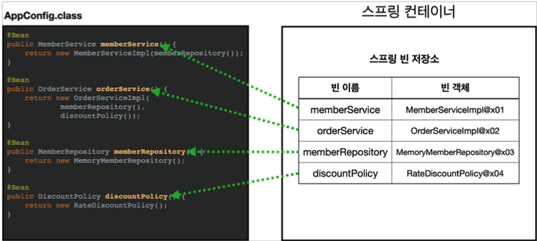
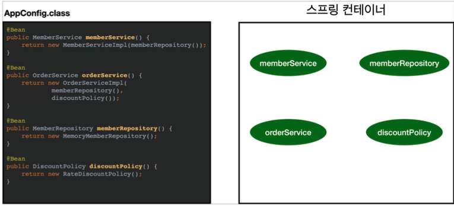

# 스프링 빈 생명주기

## 개요
- 스프링의 IoC 컨테이너는 Bean 객체들을 책임지고 의존성을 관리한다.
  - 객체들을 관리한다는 것은 객체의 생성부터 소멸까지의 생명주기(LifeCycle) 관리를 개발자가 아닌 컨테이너가 대신 해준다는 말이다.
  - 객체 관리의 주체가 프레임워크(Container)가 되기 때문에 개발자는 로직에 집중할 수 있는 장점이 있다.

## 빈 생명주기 콜백의 필요성
- 먼저 콜백에 대해 설명하면, 주로 콜백 함수를 부를 때 사용되는 용어이며 콜백 함수를 등록하면 특정 이벤트가 발생했을 때 해당 메소드가 호출된다.
  - 즉, 조건에 따라 실행될 수도 실행되지 않을 수도 있는 개념이라고 보면 된다.
- 보통 프로젝트를 하다 보면 DB 연결, 네트워크 소켓 연결 등과 같이 시작 시점에 미리 연결한 뒤 어플리케이션 종료 시점에 연결을 종료해야 하는 경우 객체의 초기화 및 종료 작업이 필요할 것이다.
  - (Ex. 커넥션 풀의 connect & disconnect)
- 스프링 빈도 위와 같은 원리로 초기화 작업과 종료 작업이 나눠서 진행된다.
  - 간단히 말해서 객체 생성 → 의존관계 주입이라는 생명 주기를 가진다.
  - 즉, 스프링 빈은 의존관계 주입이 다 끝난 후에야 필요한 데이터를 사용할 수 있는 준비가 완료된다.

## 의존성 주입 과정
<p align="center"></p>

- 가장 처음에는 Spring IoC 컨테이너가 만들어지는 과정이 일어난다.
- 위의 그림은 SpringBoot에서 Component-Scan으로 Bean 등록을 시작하는 과정을 그림으로 표현한 것이다.

<p align="center"></p>

- 위와 같이 @Configuration 방법을 통해 Bean으로 등록할 수 있는 어노테이션들과 설정파일들을 읽어 IoC 컨테이너 안에 Bean으로 등록시킨다.

<p align="center"></p>

- 그리고 의존 관계를 주입하기 전의 준비 단계가 존재한다.
- 이 단계에서 객체의 생성이 일어난다. 여기서 한 가지 알고 넘어가야 할 부분이 있다.

```
생성자 주입 : 객체의 생성과 의존관계 주입이 동시에 일어남
Setter, Field 주입 : 객체의 생성 → 의존관계 주입으로 생명 주기가 나누어져 있음
```
- 즉, 생성자 주입은 위의 그림이 동시에 진행된다는 뜻이다.
- 왜 생성자 주입은 동시에 일어나는 것일까?

```java
@Controller
public class CocoController {
    private final CocoService cocoService;
 
    public CocoController(CocoService cocoService) {
        this.cocoService = cocoService;
    }
}
```

- 자바에서 new 연산을 호출하면 생성자가 호출이 된다.
- Controller 클래스에 존재하는 Service 클래스와의 의존관계가 존재하지 않는다면, 다음과 같이 Controller 클래스는 객체 생성이 불가능할 것이다.

```java
public class Main {
    public static void main(String[] args) {
 
        // CocoController controller = new CocoController(); // 컴파일 에러
 
        CocoController controller1 = new CocoController(new CocoService());
    }
}
```

- 그렇기 때문에 생성자 주입에서는 객체 생성, 의존관계 주입이 하나의 단계에서 일어나는 것이다.
- 이를 통해 얻는 이점은 다음과 같다.
1. null을 주입하지 않는 한 NullPointerException은 발생하지 않는다.
2. 의존관계를 주입하지 않은 경우 객체를 생성할 수 없다. 즉, 의존관계에 대한 내용을 외부로 노출시킴으로써 컴파일 타임에 오류를 잡아낼 수 있다.
---
- 이번에는 setter 주입의 경우를 보자.

```java
@Controller
public class CocoController {
	
    private CocoService cocoService;
    
    @Autowired
    public void setCocoService(CocoService cocoService) {
    	this.cocoService = cocoService;
    }
}
```

- setter 주입의 경우 Controller 객체를 만들 때 의존 관계는 필요하지 않다.
- 즉, 생성자 주입과는 다르게 Controller 객체를 만들 때 Service 객체와 의존 관계가 없어도 Controller 객체를 만들 수 있다.
  - 따라서 객체 생성 → 의존 관계 주입의 단계로 나누어서 Bean LifeCycle 이 진행된다.

## 스프링 빈 이벤트 라이프 사이클
- 먼저 스프링 Bean의 LifeCycle을 보면 다음과 같다.

```
1) 스프링 IoC 컨테이너 생성
2) 스프링 빈 생성
3) 의존관계 주입
4) 초기화 콜백 메소드 호출
5) 사용
6) 소멸 전 콜백 메소드 호출
7) 스프링 종료
```

- 스프링은 의존관계 주입이 완료되면 스프링 빈에게 콜백 메소드를 통해 초기화 시점을 알려주며, 스프링 컨테이너가 종료되기 직전에도 소멸 콜백 메소드를 통해 소멸 시점을 알려준다.
- 그렇다면, 스프링 빈 라이프 사이클을 압축시키기 위해 생성자 주입을 통해 빈 생성과 초기화를 동시에 진행하면 되지 않을까?

### 객체의 생성과 초기화를 분리하자.
- 생성자는 파라미터를 받고, 메모리를 할당해서 객체를 생성하는 책임을 가진다.
- 반면에 초기화는 이렇게 생성된 값들을 활용해서 외부 커넥션을 연결하는 등 무거운 동작을 수행한다.
- 따라서 생성자 안에서 무거운 초기화 작업을 함께 하는 것보다는 객체를 생성하는 부분과 초기화 하는 부분을 명확하게 나누는 것이 유지보수 관점에서 좋다.
  - 물론, 초기화 작업이 내부 값들만 약간 변경하는 정도로 단순한 경우에는 생성자에서 한번에 처리하는 것이 나을 수 있다.

## 빈 생명주기 콜백 3가지
- 스프링은 크게 3가지 방법으로 빈 생명주기 콜백을 관리한다.

```
1) 인터페이스(InitializingBean, DisposableBean)
2) 설정 정보에 초기화 메소드, 종료 메소드 지정
3) @PostConstruct, @PreDestroy 어노테이션 지원
```

### 1) 인터페이스( InitializingBean, DisposableBean )
```java
public class ExampleBean implements InitializingBean, DisposableBean {
 
    @Override
    public void afterPropertiesSet() throws Exception {
        // 초기화 콜백 (의존관계 주입이 끝나면 호출)
    }
 
    @Override
    public void destroy() throws Exception {
        // 소멸 전 콜백 (메모리 반납, 연결 종료와 같은 과정)
    }
}
```
- InitalizingBean은 afterPropertiesSet() 메소드로 초기화를 지원한다. (의존관계 주입이 끝난 후 초기화 진행)
- DisposableBean은 destory() 메소드로 소멸을 지원한다. (Bean 종료 전에 마무리 작업, 예를 들면 자원 해제(close() 등))

#### 단점
- InitalizingBean, DisposableBean 인터페이스는 스프링 전용 인터페이스이다. 해당 코드가 인터페이스에 의존한다.
- 초기화, 소멸 메소드를 오버라이드 하기 때문에 메소드명을 변경할 수 없다.
- 코드를 커스터마이징 할 수 없는 외부 라이브러리에 적용 불가능하다.
- 인터페이스를 사용하는 초기화 및 종료 방법은 스프링 초창기에 나온 방법들이며, 지금은 거의 사용하지 않는다.

### 2) 설정 정보에서 초기화 메소드, 종료 메소드 지정
```java
public class ExampleBean {
 
    public void initialize() throws Exception {
        // 초기화 콜백 (의존관계 주입이 끝나면 호출)
    }
 
    public void close() throws Exception {
        // 소멸 전 콜백 (메모리 반납, 연결 종료와 같은 과정)
    }
}
 
@Configuration
class LifeCycleConfig {
 
    @Bean(initMethod = "initialize", destroyMethod = "close")
    public ExampleBean exampleBean() {
        // 생략
    }
}
```

#### 장점
- 메소드명을 자유롭게 부여 가능하다.
- 스프링 코드에 의존하지 않는다.
- 설정 정보를 사용하기 때문에 코드를 커스터마이징 할 수 없는 외부라이브러리에서도 적용 가능하다.

#### 단점
- Bean 지정시 initMethod와 destoryMethod를 직접 지정해야 하기에 번거롭다.

#### @Bean의 destoryMethod 속성의 특징
- 라이브러리는 대부분 종료 메소드명이 close 혹은 shutdown이다.
- @Bean의 destoryMethod는 기본값이 inferred(추론)으로 등록 즉, close, shutdown이라는 이름의 메소드가 종료 메소드라고 추론하고 자동으로 호출해준다.
  - 즉, 종료 메소드를 따로 부여하지 않더라도 잘 작동한다.
- 추론 기능을 사용하기 싫다면 명시적으로 destroyMethod=""으로 지정해줘야 한다.

### 3) @PostConstruct, @PreDestory 어노테이션
```java
import javax.annotation.PostConstruct;
import javax.annotation.PreDestroy;
 
public class ExampleBean {
 
    @PostConstruct
    public void initialize() throws Exception {
        // 초기화 콜백 (의존관계 주입이 끝나면 호출)
    }
 
    @PreDestroy
    public void close() throws Exception {
        // 소멸 전 콜백 (메모리 반납, 연결 종료와 같은 과정)
    }
}
```

#### 장점
- 최신 스프링에서 가장 권장하는 방법이다.
- 어노테이션 하나만 붙이면 되므로 매우 편리하다.
- 패키지가 javax.annotation.xxx 이다. 스프링에 종속적인 기술이 아닌 JSR-250이라는 자바 표준이다. 따라서 스프링이 아닌 다른 컨테이너에서도 동작한다.
- 컴포넌트 스캔과 잘 어울린다.

#### 단점
- 커스터마이징이 불가능한 외부 라이브러리에서 적용이 불가능하다.
  - 외부 라이브러리에서 초기화, 종료를 해야 할 경우 두 번째 방법 즉, @Bean의 initMethod와 destoryMethod 속성을 사용하자.


