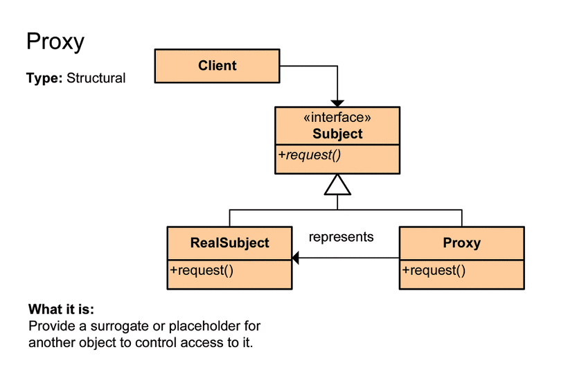
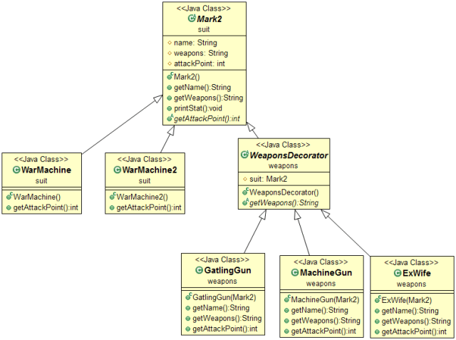

# 프록시, 데코레이터 패턴 (Proxy & Decorator Pattern)

## 1. 프록시 패턴의 정의
- Proxy는 대리자라는 뜻이다. 다른 누군가를 대신해서 그 역할을 수행하는 존재이다. 즉 프록시에게 어떤 일을 대신 시키게 된다.
- 구체적으로 인터페이스를 사용하고 실제 기능을 하는 타겟 클래스 대신 이를 대신할 프록시 클래스를 만들고 프록시 클래스가 타겟 클래스를 호출하는 것
- 이 때, 프록시는 흐름제어만 할 뿐 결과값을 조작하거나 변경시키면 안 된다.
- 아래와 같은 구조로 예시를 들면 다음과 같다.

<p align="center"></p>

#### ServiceI 인터페이스
```java
public interface ServiceI { 
    String run();
}
```

#### TargetService 클래스
```java
public class TargetService implements ServiceI{
 
    @Override
    public String run() {
        return "실제 클래스입니다.";
    }
     
}
```

#### ProxyService 클래스
```java
public class ProxyService implements IService{
 
    ServiceI service;
     
    @Override
    public String run() {
        System.out.println("흐름을 바꿈 결과 값은 같다.");
         
        service = new Service(); 
        return service.run();
    }
 
}
```

#### 클라이언트
```java
public class Main {
 
    public static void main(String[] args) {
        //직접 호출하지 않고 프록시를 호출한다.
        ServiceI proxy = new ProxyService();
        System.out.println(proxy.run());
    }
}
```

## 2. 데코레이터 패턴의 정의
 
- 객체에 추가적인 요건을 동적으로 첨가한다.
- 데코레이터는 서브클래스를 만드는 것을 통해서 기능을 유연하게 확장할 수 있는 방법을 제공한다. 즉 타깃에 부가적인 기능을 부여하는 것을 의미한다.
- 아래와 같은 구조로 예시를 들면 다음과 같다.

<p align="center"></p>

#### Beverage 클래스
```java
public abstract class Beverage {
    
    String description = "no title"; //음료 이름
 
    public abstract int cost();
 
    public String getDescription() {
        return description;
    }
    
}
```

#### CaffeLatte 클래스
```java
public class CaffeLatte extends Beverage {
 
    public CaffeLatte() {
        super();
        description = "카페라떼";
    }
 
    @Override
    public int cost() {
        return 5000;
    }
}
```

#### CondimentDecorator 클래스
```java
public abstract class CondimentDecorator extends Beverage {
    
    public abstract String getDescription();
}
```

#### Cream 클래스
```java
public class Cream extends CondimentDecorator {
 
    Beverage beverage;

    public Cream(Beverage beverage) {
        super();
        this.beverage = beverage;
    }
 
    @Override
    public String getDescription() {
        return beverage.getDescription() + ", 크림";
    }
 
    @Override
    public int cost() {
        return beverage.cost() + 500;
    }
}
```

#### Main 클래스
```java
public class Test {
    public static void main(String[] args) {
        
        Beverage beverage = new CafeLatte();
        beverage = new Cream(beverage); //beverage 필드에 CaffeLatte 인스턴스 저장
        
        System.out.println("가격 : " + beverage.cost());
    }
}
```

## 3. 프록시, 데코레이터의 차이
- 둘 다 기존 타겟 객체가 아닌 다른 곳에서의 행위가 일어나므로 비슷하게 느껴진다.
- 그러나, 프록시 패턴은 요청을 위임해주는데 의의가 있고, 데코레이터 패턴은 부가 기능을 추가하는 데에 있다.

## 4. spring AOP개념에서의 proxy는?
- 아래와 같이 트랜잭션을 분리할때 proxy는 디자인 패턴으로 봤을때 프록시 패턴인가? 데코레이터 패턴인가?
- 기존 타겟코드(DAO의 요청을 업데이트하는 부분)에 트랜잭션을 적용하는 부분으로 바라보았을 때는 데코레이터 패턴의 역할로 볼 수 있다.
- 타겟 클래스 전후로 요청을 위임하는 부분으로 보았을 때는 프록시 패턴으로 바라볼 수도 있다.

```java
public class TransactionHandler implements InvocationHandler {
    private Object target;
    private PlatformTransactionManager transactionManager;
    private String pattern; //트랜잭션을 적용할 메소드 이름 패턴
    
    public void setTarget(Object target) {
        this.target = target;
    }
    
    public void setTransactionManager(PlatormTransactionManager transactionManager) {
        this.transactionManager = transactionManager;
    }
    
    public void setPattern(String pattern) {
        this.pattern = pattern;
    }
    
    public Object invoke(Object proxy, Method method, Object[] args) throws Throwable {
        if(method.getName().startsWith(pattern)) {
            return invokeInTransaction(method, args);
        } else {
            return method.invoke(target, args);
        }
    }
    
    private Object invokeInTransaction(Method method, Object[] args) throws Throwable {
        TransactionStatus status = this.transactionManager.getTransaction(new DefaultTransactionDefinition());
        try {
            Object ret = method.invoke(target, args);
            this.transactionManager.commit(status); // 타깃 호출 후 예외가 발생하지 않으면 commit
            return ret;
        } catch (InvocationTargetException e) { // 예외가 발생하면 트랜잭션 롤백
            this.transactionManager.rollback(status);
            return e.getTargetException();
        }
    }
}
```


