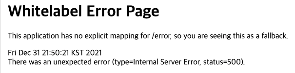

# 스프링의 기본적인 예외 처리 방법
- Spring이 제공하는 다양한 예외 처리 방법들을 살펴보기 전에, 먼저 우리가 개발한 Controller에서 발생한 예외를 Spring은 기본적으로 어떻게 처리하고 있는지 살펴보도록 하자.
- 아래의 내용들은 SpringBoot를 기반으로 설명된다.

## Spring의 기본적인 예외 처리 방식(SpringBoot)
- 예를 들어 우리가 만든 다음과 같은 컨트롤러가 있다고 하자.

```java
@RestController
@RequiredArgsConstructor
public class ProductController {

    private final ProductService productService;
  
    @GetMapping("/product/{id}")
    public Response getProduct(@PathVariable String id) {
        return productService.getProduct(id);
    }
}
```

- getProduct에서 NoSuchElementFoundException 예외가 발생했다면 우리는 접속한 환경에 따라 다른 에러 처리를 받게 될 것이다.
- 만약 우리가 웹 페이지로 접속했다면 다음과 같은 whiltelabel 에러 페이지를 반환받는다.


<p align="center"></p>

- Spring은 만들어질 때(1.0)부터 에러 처리를 위한 BasicErrorController를 구현해두었고, 스프링 부트는 예외가 발생하면 기본적으로 /error로 에러 요청을 다시 전달하도록 WAS 설정을 해두었다.
  - 그래서 별도의 설정이 없다면 예외 발생 시 BasicErrorController로 에러 처리 요청이 전달된다.
  - 참고로 이는 스프링 부트의 WebMvcAutoConfiguration를 통해 자동 설정이 되는 WAS의 설정이다.
- 여기서 요청이 /error로 다시 전달된다는 부분에 주목해야 한다. 일반적인 요청 흐름은 다음과 같이 진행된다.

```
WAS(톰캣) -> 필터 -> 서블릿(디스패처 서블릿) -> 인터셉터 -> 컨트롤러
```

- 그리고 컨트롤러 하위 계층에서 예외가 발생하였을 때, 별도의 예외 처리를 하지 않으면 WAS까지 에러가 전달된다.
- 그러면 WAS는 애플리케이션에서 처리를 못하는 예와라 exception이 올라왔다고 판단을 하고, 대응 작업을 진행한다.

```
컨트롤러(예외발생) -> 인터셉터 -> 서블릿(디스패처 서블릿) -> 필터 -> WAS(톰캣)
```

- WAS는 스프링 부트가 등록한 에러 설정(/error)에 맞게 요청을 전달하는데, 이러한 흐름을 총 정리하면 다음과 같다.

```
WAS(톰캣) -> 필터 -> 서블릿(디스패처 서블릿) -> 인터셉터 -> 컨트롤러
-> 컨트롤러(예외발생) -> 인터셉터 -> 서블릿(디스패처 서블릿) -> 필터 -> WAS(톰캣)
-> WAS(톰캣) -> 필터 -> 서블릿(디스패처 서블릿) -> 인터셉터 -> 컨트롤러(BasicErrorController)
```

- 기본적인 에러 처리 방식은 결국 에러 컨트롤러를 한번 더 호출하는 것이다.
  - 그러므로 필터나 인터셉터가 다시 호출될 수 있는데, 이를 제어하기 위해서는 별도의 설정이 필요하다.
- 서블릿은 dispatcherType로 요청의 종류를 구분하는데, 일반적인 요청은 REQUEST이며 에러 처리 요청은 ERROR이다.
- 필터는 서블릿 기술이므로 필터 등록(FilterRegistrationBean) 시에 호출될 dispatcherType 타입을 설정할 수 있고, 별도의 설정이 없다면 REQUEST일 경우에만 필터가 호출된다.
- 하지만 인터셉터는 스프링 기술이므로 dispatcherType을 설정할 수 없어 URI 패턴으로 처리가 필요하다.
- 스프링 부트에서는 WAS까지 직접 제어하게 되면서 이러한 WAS의 에러 설정까지 가능해졌다.
  - 또한 이는 요청이 2번 생기는 것은 아니고, 1번의 요청이 2번 전달되는 것이다.
  - 그러므로 클라이언트는 이러한 에러 처리 작업이 진행되었는지 알 수 없다.

## BasicErrorController의 동작 및 에러 속성들
- BasicErrorController는 accept 헤더에 따라 에러 페이지를 반환하거나 에러 메세지을 반환한다.
- 에러 경로는 기본적으로 /error로 정의되어 있으며 properties에서 server.error.path로 변경할 수 있다.

```java
@Controller
@RequestMapping("${server.error.path:${error.path:/error}}")
public class BasicErrorController extends AbstractErrorController {

    private final ErrorProperties errorProperties;
    ...

    @RequestMapping(produces = MediaType.TEXT_HTML_VALUE)
    public ModelAndView errorHtml(HttpServletRequest request, HttpServletResponse response) {
        ...
    }

    @RequestMapping
    public ResponseEntity<Map<String, Object>> error(HttpServletRequest request) {
        ...
        return new ResponseEntity<>(body, status);
    }
    
    ...
}
```

- errorHtml()과 error()는 모두 getErrorAttributeOptions를 호출해 반환할 에러 속성을 얻는데, 기본적으로 DefaultErrorAttributes로부터 반환할 정보를 가져온다.
- DefaultErrorAttributes는 전체 항목들에서 설정에 맞게 불필요한 속성들을 제거한다.
  - timestamp: 에러가 발생한 시간
  - status: 에러의 Http 상태
  - error: 에러 코드
  - path: 에러가 발생한 uri
  - exception: 최상위 예외 클래스의 이름(설정 필요)
  - message: 에러에 대한 내용(설정 필요)
  - errors: BindingExecption에 의해 생긴 에러 목록(설정 필요)
  - trace: 에러 스택 트레이스(설정 필요)

```
{
    "timestamp": "2021-12-31T03:35:44.675+00:00",
    "status": 500,
    "error": "Internal Server Error",
    "path": "/product/5000"
}
```

- 위는 기본 설정으로 받는 에러 응답인데, 나름 잘 갖추어져 있지만 클라이언트 입장에서 유용하지 못하다.
  - 클라이언트는 “Item with id 5000 not found” 라는 메세지와 함께 404 status로 에러 응답을 받으면 훨씬 유용할 것이다.
- 다음과 같이 properties를 통해 에러 응답을 조정할 수 있다. 물론 운영 환경에서 구현이 노출되는 trace는 제공하지 않는 것이 좋다.
- 참고로 SpringBoot 2.3 이전에는 message를 기본적으로 제공하고 있었지만, SpringBoot 2.3부터는 클라이언트에게 너무 많은 정보가 노출되는 것을 방지하기 위해 기본적으로 제공하지 않게 되었다.

```
server.error.include-message: always
server.error.include-binding-errors: always
server.error.include-stacktrace: always
server.error.include-exception: false
```

- 하지만 설정을 변경했음에도 불구하고 status는 여전히 500이며, 유의미한 에러 응답을 전달하지 못한다. (참고로 여기서 status가 500인 이유는 에러가 처리되지 않고 WAS가 에러를 전달받았기 때문이다.)
- 또한 흔히 사용되는 API 에러 처리 응답으로는 보다 세밀한 제어가 요구된다.
- 그러므로 우리는 별도의 에러 처리 전략을 통해 상황에 맞는 에러 응답을 제공해야 한다.

```
{
    "timestamp": "2021-12-31T03:35:44.675+00:00",
    "status": 500,
    "error": "Internal Server Error",
    "trace": "java.util.NoSuchElementException: No value present ...",
    "message": "No value present",
    "path": "/product/5000"
}
```
