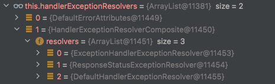

# 스프링이 제공하는 다양한 예외처리 방법
- Java에서는 예외 처리를 위해 try-catch를 사용해야 하지만 try-catch를 모든 코드에 붙이는 것은 비효율적이다.
- Spring은 에러 처리라는 공통 관심사(cross-cutting concerns)를 메인 로직으로부터 분리하는 다양한 예외 처리 방식을 고안하였다.
  - 예외 처리 전략을 추상화한 HandlerExceptionResolver 인터페이스를 만들었다. (전략 패턴의 사용)
- 대부분의 HandlerExceptionResolver는 발생한 Exception을 catch 하고 HTTP 상태나 응답 메세지 등을 설정한다.
- 그래서 WAS 입장에서는 해당 요청이 정상적인 응답인 것으로 인식되며, 이전 글에서 설명한 복잡한 WAS의 에러 전달이 진행되지 않는다.

```java
public interface HandlerExceptionResolver {
    ModelAndView resolveException(HttpServletRequest request, 
            HttpServletResponse response, Object handler, Exception ex);
}
```

- 위의 Object 타입인 handler는 예외가 발생한 컨트롤러 객체이다.
- 예외가 던져지면 디스패처 서블릿까지 전달되는데, 적합한 예외 처리를 위해 HandlerExceptionResolver 구현체들을 빈으로 등록해서 관리한다.
- 그리고 적용 가능한 구현체를 찾아 예외 처리를 하는데, 우선순위대로 아래의 4가지 구현체들이 빈으로 등록되어 있다.
  - DefaultErrorAttributes : 에러 속성을 저장하며 직접 예외를 처리하지는 않는다.
  - ExceptionHandlerExceptionResolver : 에러 응답을 위한 Controller나 ControllerAdvice에 있는 ExceptionHandler를 처리함
  - ResponseStatusExceptionResolver : HTTP 상태 코드를 지정하는 @ResponseStatus 또는 ResponseStatusException를 처리함
  - DefaultHandlerExceptionResolver :  스프링 내부의 기본 예외들을 처리한다.

- DefaultErrorAttributes는 직접 예외를 처리하지 않고 속성만 관리하므로 성격이 다르다.
  - 그래서 내부적으로 DefaultErrorAttributes를 제외하고 직접 예외를 처리하는 3가지 ExceptionResolver들을 HandlerExceptionResolverComposite로 모아서 관리한다.
  - 즉, 컴포지트 패턴을 적용해 실제 예외 처리기들을 따로 관리하는 것이다.

<p align="center"></p>

## ExceptionResolver 동작 방식
- Spring은 아래와 같은 도구들로 ExceptionResolver를 동작시켜 에러를 처리할 수 있는데, 각각의 방식에 대해 자세히 살펴보도록 하자.

```
1) ResponseStatus
2) ResponseStatusException
3) ExceptionHandler
4) ControllerAdvice, RestControllerAdvice
```

### 1) @ResponseStatus 
- 어노테이션 이름에서 예측 가능하듯이 @ResponseStatus는 에러 HTTP 상태를 변경하도록 도와주는 어노테이션이다.
- @ResponseStatus는 다음과 같은 경우들에 적용할 수 있다.
  - Exception 클래스 자체
  - 메소드에 @ExceptionHandler와 함께
  - 클래스에 @RestControllerAdvice와 함께
- 예를 들어 우리가 만든 예외 클래스에 다음과 같이 @ResponseStatus로 응답 상태를 지정해줄 수 있다.

```java
@ResponseStatus(value = HttpStatus.NOT_FOUND)
public class NoSuchElementFoundException extends RuntimeException {
  ...
}
```

- 그러면 ResponseStatusExceptionResolver가 지정해준 상태로 에러 응답이 내려가도록 처리한다.

```
{
    "timestamp": "2021-12-31T03:35:44.675+00:00",
    "status": 404,
    "error": "Not Found",
    "path": "/product/5000"
}
```

- 하지만 에러 응답에서 볼 수 있듯 이는 BasicErrorController에 의한 응답이다.
- 즉, @ResponseStatus를 처리하는 ResponseStatusExceptionResolver는 WAS까지 예외를 전달시키며, 복잡한 WAS의 에러 요청 전달이 진행되는 것이다.

### @ResponseStatus의 한계점
1. 에러 응답의 내용(Payload)를 수정할 수 없음(DefaultErrorAttributes를 수정하면 가능하긴 함)
2. 예와 클래스와 강하게 결합되어 같은 예외는 같은 상태와 에러 메세지를 반환함
3. 별도의 응답 상태가 필요하다면 예외 클래스를 추가해야 됨
4. WAS까지 예외가 전달되고, WAS의 에러 요청 전달이 진행됨
5. 외부에서 정의한 Exception 클래스에는 @ResponseStatus를 붙여줄 수 없음
 
- 물론 프로퍼티 설정이나 에러 응답 커스터마이징을 통해 일부 문제를 해결할 수 있고, 메세지 소스를 사용해 다국어 처리도 할 수 있다.
- 하지만 개발자가 원하는대로 에러를 처리하는 것은 어려운데, 이러한 문제를 해결하기 위해서는 다른 방법을 사용해야 한다.

### 2) ResponseStatusException 
- 외부 라이브러리에서 정의한 코드는 우리가 수정할 수 없으므로 @ResponseStatus를 붙여줄 수 없다.
- Spring5에는 @ResponseStatus의 프로그래밍적 대안으로써 손쉽게 에러를 반환할 수 있는 ResponseStatusException가 추가되었다.
- ResponseStatusException는 HttpStatus와 함께 선택적으로 reason과 cause를 추가할 수 있고, 언체크 예외을 상속받고 있어 명시적으로 에러를 처리해주지 않아도 된다.
- 이러한 ResponseStatusException은 다음과 같이 사용할 수 있다.

```java
@GetMapping("/product/{id}")
public ResponseEntity<Product> getProduct(@PathVariable String id) {
    try {
        return ResponseEntity.ok(productService.getProduct(id));
    } catch (NoSuchElementFoundException e) {
        throw new ResponseStatusException(HttpStatus.NOT_FOUND, "Item Not Found");
    }
}
```

 

@ResponseStatus와 동일하게 예외가 발생하면 ResponseStatusExceptionResolver가 에러를 처리한다. ResponseStatusException를 사용하면 다음과 같은 이점을 누릴 수 있다.

기본적인 예외 처리를 빠르게 적용할 수 있으므로 손쉽게 프로토타이핑할 수 있음
HttpStatus를 직접 설정하여 예외 클래스와의 결합도를 낮출 수 있음
불필요하게 많은 별도의 예외 클래스를 만들지 않아도 됨
프로그래밍 방식으로 예외를 직접 생성하므로 예외를 더욱 잘 제어할 수 있음
 

하지만 그럼에도 불구하고 ResponseStatusException는 다음과 같은 한계점들을 가지고 있다. 이러한 이유로 API 에러 처리를 위해서는 @ExceptionHandler를 사용하는 방식이 더 많이 사용된다.

직접 예외 처리를 프로그래밍하므로 일관된 예외 처리가 어려움
예외 처리 코드가 중복될 수 있음
Spring 내부의 예외를 처리하는 것이 어려움
예외가 WAS까지 전달되고, WAS의 에러 요청 전달이 진행됨
 

 

 

[ @ExceptionHandler ]
@ExceptionHandler는 매우 유연하게 에러를 처리할 수 있는 방법을 제공하는 기능이다. @ExceptionHandler는 다음에 어노테이션을 추가함으로써 에러를 손쉽게 처리할 수 있다.

컨트롤러의 메소드
@ControllerAdvice나 @RestControllerAdvice가 있는 클래스의 메소드
 

 

예를 들어 다음과 같이 컨트롤러의 메소드에 @ExceptionHandler를 추가함으로써 에러를 처리할 수 있다. @ExceptionHandler에 의해 발생한 예외는 ExceptionHandlerExceptionResolver에 의해 처리가 된다.

@RestController
@RequiredArgsConstructor
public class ProductController {

  private final ProductService productService;
  
  @GetMapping("/product/{id}")
  public Response getProduct(@PathVariable String id){
    return productService.getProduct(id);
  }

  @ExceptionHandler(NoSuchElementFoundException.class)
  public ResponseEntity<String> handleNoSuchElementFoundException(NoSuchElementFoundException exception) {
    return ResponseEntity.status(HttpStatus.NOT_FOUND).body(exception.getMessage());
  }
}
 

 

@ExceptionHandler는 Exception 클래스들을 속성으로 받아 처리할 예외를 지정할 수 있다. 만약 ExceptionHandler 어노테이션에 예외 클래스를 지정하지 않는다면, 파라미터에 설정된 에러 클래스를 처리하게 된다. 또한 @ResponseStatus와도 결합가능한데,  만약 ResponseEntity에서도 status를 지정하고 @ResponseStatus도 있다면 ResponseEntity가 우선순위를 갖는다.

ExceptionHandler는 @ResponseStatus와 달리 에러 응답(payload)을 자유롭게 다룰 수 있다는 점에서 유연하다. 예를 들어 응답을 다음과 같이 정의해서 내려준다면 좋을 것이다.

code: 어떠한 종류의 에러가 발생하는지에 대한 에러 코드
message: 왜 에러가 발생했는지에 대한 설명
erros: 어느 값이 잘못되어 @Valid에 의한 검증이 실패한 것인지를 위한 에러 목록
 

여기서 code로 E001, E002 등과 같이 내부적으로 정의한 값을 사용하는 것보다 BAD_REQUEST와 같은 Http 표준 상태와과 같이 가독성 좋은 값을 사용하는 것이 클라이언트의 입장에서도 대응하기 좋고, 유지보수하는 입장에서도 좋다.

@RestController
@RequiredArgsConstructor
public class ProductController {

    ...

    @ExceptionHandler(NoSuchElementFoundException.class)
    public ResponseEntity<ErrorResponse> handleItemNotFoundException(NoSuchElementFoundException exception) {
        ...
    }

    @ExceptionHandler(MethodArgumentNotValidException.class)
    public ResponseEntity<ErrorResponse> handleMethodArgumentNotValid(MethodArgumentNotValidException ex) {
        ...
    }

    @ExceptionHandler(Exception.class)
    public ResponseEntity<ErrorResponse> handleAllUncaughtException(Exception exception) {
        ...
    }
}
 

 

Spring은 예외가 발생하면 가장 구체적인 예외 핸들러를 먼저 찾고, 없으면 부모 예외의 핸들러를 찾는다. 예를 들어 NullPointerException이 발생했다면, 위에서는 NullPointerException 처리기가 없으므로 Exception에 대한 처리기가 찾아진다.

@ExceptionHandler를 사용 시에 주의할 점은 @ExceptionHandler에 등록된 예외 클래스와 파라미터로 받는 예와 클래스가 동일해야 한다는 것이다. 만약 값이 다르다면 스프링은 컴파일 시점에 에러를 내지 않다가 런타임 시점에 에러를 발생시킨다.

java.lang.IllegalStateException: No suitable resolver for argument [0] [type=...]
HandlerMethod details: ...
 

 

ExceptionHandler의 파라미터로 HttpServletRequest나 WebRequest 등을 얻을 수 있으며 반환 타입으로는 ResponseEntity, String, void 등 자유롭게 활용할 수 있다. (더 많은 입력/반환 타입을 위해서는 공식 문서를 참고하도록 하자.)

@ExceptionHandler는 컨트롤러에 구현하므로 특정 컨트롤러에서만 발생하는 예외만 처리된다. 하지만 컨트롤러에 에러 처리 코드가 섞이며, 에러 처리 코드가 중복될 가능성이 높다. 그래서 스프링은 전역적으로 예외를 처리할 수 있는 좋은 기술을 제공해준다.

 

 

 

 

[ @ControllerAdvice와 @RestControllerAdvice ]
Spring은 전역적으로 @ExceptionHandler를 적용할 수 있는 @ControllerAdvice와 @RestControllerAdvice 어노테이션을 각각 Spring3.2, Spring4.3부터 제공하고 있다. 두 개의 차이는 @Controller와 RestController와 같이 @ResponseBody가 붙어 있어 응답을 Json으로 내려준다는 점에서 다르다. 아래 내용에서는 ControllerAdvice라고 줄여 설명을 진행하도록 하겠다.

@Target(ElementType.TYPE)
@Retention(RetentionPolicy.RUNTIME)
@Documented
@ControllerAdvice
@ResponseBody
public @interface RestControllerAdvice {
    ...
}

@Target(ElementType.TYPE)
@Retention(RetentionPolicy.RUNTIME)
@Documented
@Component
public @interface ControllerAdvice {
    ...
}
 

 

ControllerAdvice는 여러 컨트롤러에 대해 전역적으로 ExceptionHandler를 적용해준다. 위에서 보이듯 ControllerAdvice 어노테이션에는 @Component 어노테이션이 있어서 ControllerAdvice가 선언된 클래스는 스프링 빈으로 등록된다. 그러므로 우리는 다음과 같이 전역적으로 에러를 핸들링하는 클래스를 만들어 어노테이션을 붙여주면 에러 처리를 위임할 수 있다.

@RestControllerAdvice
public class GlobalExceptionHandler {

    @ExceptionHandler(NoSuchElementFoundException.class)
    protected ResponseEntity<?> handleNoSuchElementFoundException(NoSuchElementFoundException e) {
        final ErrorResponse errorResponse = ErrorResponse.builder()
                .code("Item Not Found")
                .message(e.getMessage()).build();

        return ResponseEntity.status(HttpStatus.NOT_FOUND).body(errorResponse);
    }
}
 

 

ControllerAdvice는 전역적으로 적용되는데, 만약 특정 클래스에만 제한적으로 적용하고 싶다면 @RestControllerAdvice의 basePackages 등을 설정함으로써 제한할 수 있다.

스프링 예외에는 대표적으로 잘못된 URI를 호출하여 발생하는 NoHandlerFoundException 등이 있다. Spring은 스프링 예외를 미리 처리해둔 ResponseEntityExceptionHandler를 추상 클래스로 제공하고 있다. ResponseEntityExceptionHandler에는 스프링 예외에 대한 ExceptionHandler가 모두 구현되어 있으므로 ControllerAdvice 클래스가 이를 상속받게 하면 된다.

만약 이 추상 클래스를 상속받지 않는다면 스프링 예외들은 DefaultHandlerExceptionResolver가 처리하게 되는데, 그러면 예외 처리기가 달라지므로 클라이언트가 일관되지 못한 에러 응답을 받지 못하므로 ResponseEntityExceptionHandler를 상속시키는 것이 좋다. 또한 이는 기본적으로 에러 메세지를 반환하지 않으므로, 스프링 예외에 대한 에러 응답을 보내려면 아래 메소드를 오버라이딩 해야 한다.

public abstract class ResponseEntityExceptionHandler {
    ...

    protected ResponseEntity<Object> handleExceptionInternal(
        Exception ex, @Nullable Object body, HttpHeaders headers, HttpStatus status, WebRequest request) {
            
        ...
    }
}
 

 

우리는 이러한 ControllerAdvice를 이용함으로써 다음과 같은 이점을 누릴 수 있다.

하나의 클래스로 모든 컨트롤러에 대해 전역적으로 예외 처리가 가능함
직접 정의한 에러 응답을 일관성있게 클라이언트에게 내려줄 수 있음
별도의 try-catch문이 없어 코드의 가독성이 높아짐
 

이러한 이유로 API에 의한 예외 처리를 할 때에는 ControllerAdvice를 이용하면 평가된다. 하지만 ControllerAdvice를 사용할 때에는 항상 다음의 내용들을 주의해야 한다. 여러 ControllerAdvice가 있을 때 @Order 어노테이션으로 순서를 지정하지 않는다면 Spring은 ControllerAdvice를 임의의 순서로 처리할 수 있으므로 일관된 예외 응답을 위해서는 이러한 점에 주의해야 한다.

한 프로젝트당 하나의 ControllerAdvice만 관리하는 것이 좋다.
만약 여러 ControllerAdvice가 필요하다면 basePackages나 annotations 등을 지정해야 한다.
직접 구현한 Exception 클래스들은 한 공간에서 관리한다.
