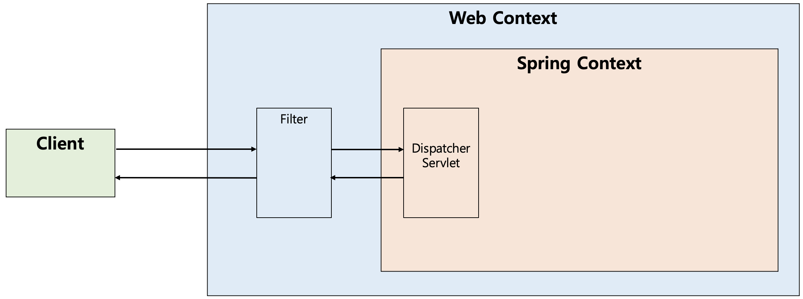

# 필터(Filter)

## 필터(Filter)란? 
<p align="center"></p>

- 필터(Filter)는 J2EE 표준 스펙 기능으로 디스패처 서블릿(Dispatcher Servlet)에 요청이 전달되기 이전에 url 패턴에 맞는 모든 요청에 대해 부가작업을 처리할 수 있는 기능을 제공한다.
- 디스패처 서블릿은 스프링의 가장 앞단에 존재하는 프론트 컨트롤러이므로, 필터는 스프링 범위 밖에서 처리가 되는 것이다.
- 즉, 스프링 컨테이너가 아닌 톰캣과 같은 웹 컨테이너(서블릿 컨테이너)에 의해 관리가 되는 것이고(스프링 빈으로 등록은 된다), 디스패처 서블릿 이전에 처리하는 것이다.
  - 이러한 과정을 그림으로 표현하면 다음과 같다.

 
## 필터(Filter)의 메소드
- 필터를 추가하기 위해서는 javax.servlet의 Filter 인터페이스를 구현(implements)해야 하며 이는 다음의 3가지 메소드를 가지고 있다.
  - init 메소드
  - doFilter 메소드
  - destroy 메소드

```java
public interface Filter {

    public default void init(FilterConfig filterConfig) throws ServletException {}

    public void doFilter(ServletRequest request, ServletResponse response,
            FilterChain chain) throws IOException, ServletException;

    public default void destroy() {}
}
```

### init 메소드
- init 메소드는 필터 객체를 초기화하고 서비스에 추가하기 위한 메소드이다.
- 웹 컨테이너가 1회 init 메소드를 호출하여 필터 객체를 초기화하면 이후의 요청들은 doFilter를 통해 처리된다.

### doFilter 메소드
- doFilter 메소드는 url-pattern에 맞는 모든 HTTP 요청이 디스패처 서블릿으로 전달되기 전에 웹 컨테이너에 의해 실행되는 메소드이다.
- doFilter의 파라미터로는 FilterChain이 있는데, FilterChain의 doFilter 통해 다음 대상으로 요청을 전달하게 된다.
- chain.doFilter() 전/후에 우리가 필요한 처리 과정을 넣어줌으로써 원하는 처리를 진행할 수 있다.

### destroy 메소드
- destroy 메소드는 필터 객체를 서비스에서 제거하고 사용하는 자원을 반환하기 위한 메소드이다.
- 이는 웹 컨테이너에 의해 1번 호출되며 이후에는 이제 doFilter에 의해 처리되지 않는다.
