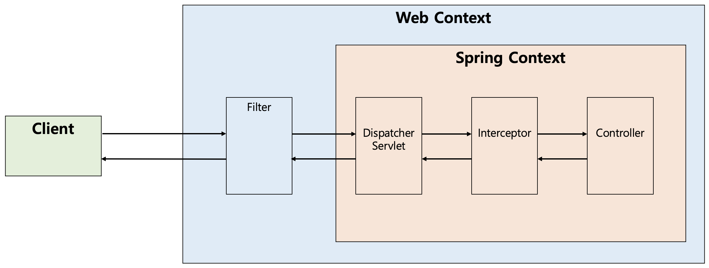

# 인터셉터(Interceptor)
## 인터셉터(Interceptor)란? 
- 인터셉터(Interceptor)는 J2EE 표준 스펙인 필터(Filter)와 달리 Spring이 제공하는 기술로써, 디스패처 서블릿(Dispatcher Servlet)이 컨트롤러를 호출하기 전과 후에 요청과 응답을 참조하거나 가공할 수 있는 기능을 제공한다.
  - 즉, 웹 컨테이너(서블릿 컨테이너)에서 동작하는 필터와 달리 인터셉터는 스프링 컨텍스트에서 동작을 하는 것이다.
- 디스패처 서블릿은 핸들러 매핑을 통해 적절한 컨트롤러를 찾도록 요청하는데, 그 결과로 실행 체인(HandlerExecutionChain)을 돌려준다.
  - 그래서 이 실행 체인은 1개 이상의 인터셉터가 등록되어 있다면 순차적으로 인터셉터들을 거쳐 컨트롤러가 실행되도록 하고,
  - 인터셉터가 없다면 바로 컨트롤러를 실행한다.
- 인터셉터는 스프링 컨테이너 내에서 동작하므로 필터를 거쳐 프론트 컨트롤러인 디스패처 서블릿이 요청을 받은 이후에 동작하게 되는데, 이러한 호출 순서를 그림으로 표현하면 다음과 같다.
  - 실제로는 Interceptor가 Controller로 요청을 위임하지는 않는다. 아래의 그림은 처리 순서를 도식화한 것으로만 이해하면 된다.

<p align="center"></p>
 
## 인터셉터(Interceptor)의 메소드 
- 인터셉터를 추가하기 위해서는 org.springframework.web.servlet의 HandlerInterceptor 인터페이스를 구현(implements)해야 하며, 이는 다음의 3가지 메소드를 가지고 있다.
  - preHandle 메소드
  - postHandle 메소드
  - afterCompletion 메소드

```java
public interface HandlerInterceptor {

    default boolean preHandle(HttpServletRequest request, HttpServletResponse response, Object handler)
        throws Exception {
        
        return true;
    }

    default void postHandle(HttpServletRequest request, HttpServletResponse response, Object handler,
        @Nullable ModelAndView modelAndView) throws Exception {
    }

    default void afterCompletion(HttpServletRequest request, HttpServletResponse response, Object handler,
        @Nullable Exception ex) throws Exception {
    }
}
```

### preHandle 메소드
- preHandle 메소드는 컨트롤러가 호출되기 전에 실행된다.
  - 그렇기 때문에 컨트롤러 이전에 처리해야 하는 전처리 작업이나 요청 정보를 가공하거나 추가하는 경우에 사용할 수 있다.
- preHandle의 3번째 파라미터인 handler 파라미터는 핸들러 매핑이 찾아준 컨트롤러 빈에 매핑되는 HandlerMethod 라는 새로운 타입의 객체로써,
  - @RequestMapping이 붙은 메소드의 정보를 추상화한 객체이다.
- 또한 preHandle의 반환 타입은 boolean인데
  - 반환값이 true면 다음 단계로 진행이 되지만,
  - false라면 작업을 중단하여 이후의 작업(다음 인터셉터 또는 컨트롤러)은 진행되지 않는다.

### postHandle 메소드
- postHandle 메소드는 컨트롤러를 호출된 후에 실행된다.
  - 그렇기 때문에 컨트롤러 이후에 처리해야 하는 후처리 작업이 있을 때 사용할 수 있다.
- 이 메소드에는 컨트롤러가 반환하는 ModelAndView 타입의 정보가 제공되는데, 최근에는 Json 형태로 데이터를 제공하는 RestAPI 기반의 컨트롤러(@RestController)를 만들면서 자주 사용되지는 않는다.
- 또한 컨트롤러 하위 계층에서 작업을 진행하다가 중간에 예외가 발생하면 postHandle은 호출되지 않는다.

### afterCompletion 메소드
- afterCompletion 메소드는 이름 그대로 모든 뷰에서 최종 결과를 생성하는 일을 포함해 모든 작업이 완료된 후에 실행된다.
  - 요청 처리 중에 사용한 리소스를 반환할 때 사용하기에 적합하다.
- postHandler와 달리 컨트롤러 하위 계층에서 작업을 진행하다가 중간에 예외가 발생하더라도 afterCompletion은 반드시 호출된다.

## 인터셉터(Interceptor)와 AOP의 비교
- 인터셉터 대신에 컨트롤러들에 적용할 부가기능을 어드바이스로 만들어 AOP(Aspect Oriented Programming, 관점 지향 프로그래밍)를 적용할 수도 있다.
- 하지만 다음과 같은 이유들로 컨트롤러의 호출 과정에 적용되는 부가기능들은 인터셉터를 사용하는 편이 낫다.

### 이유 
- 컨트롤러는 타입과 실행 메소드가 모두 제각각이라 포인트컷(적용할 메소드 선별)의 작성이 어렵다.
- 컨트롤러는 파라미터나 리턴 값이 일정하지 않다.
- AOP에서는 HttpServletRequest/Response를 객체를 얻기 어렵지만 인터셉터에서는 파라미터로 넘어온다.
