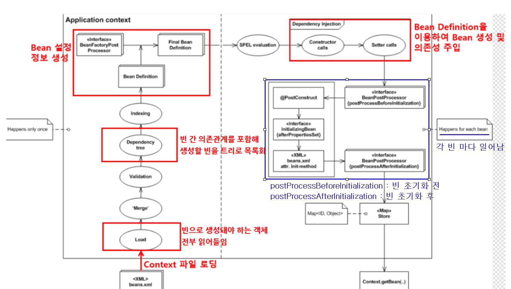
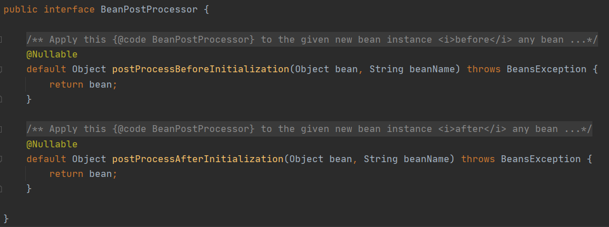
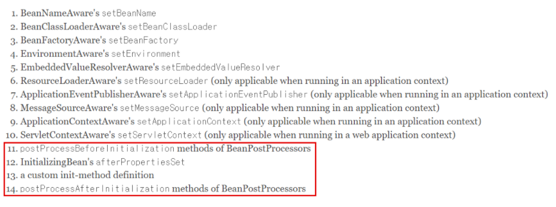
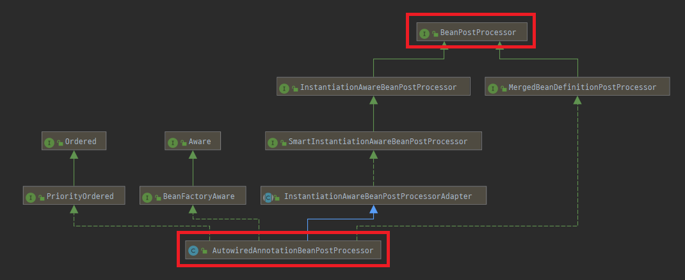
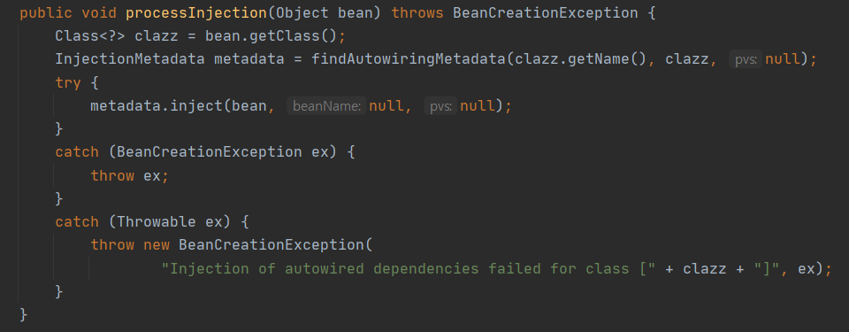
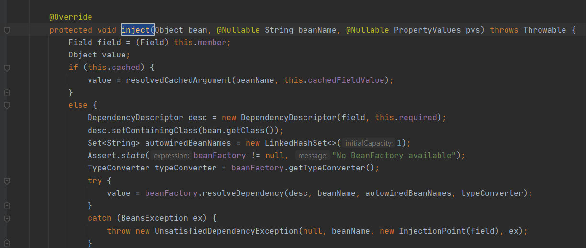
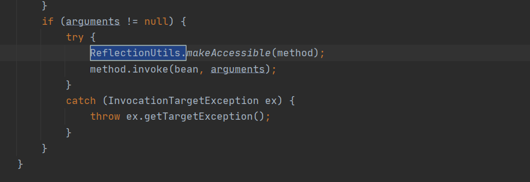
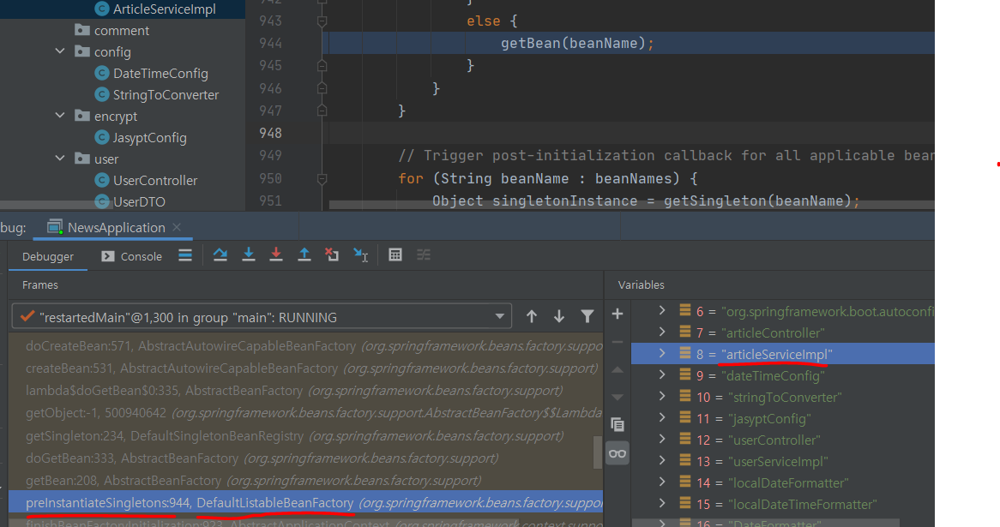
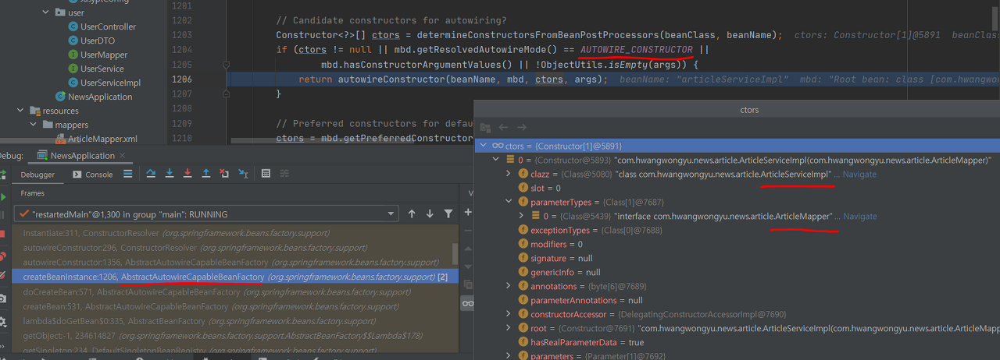
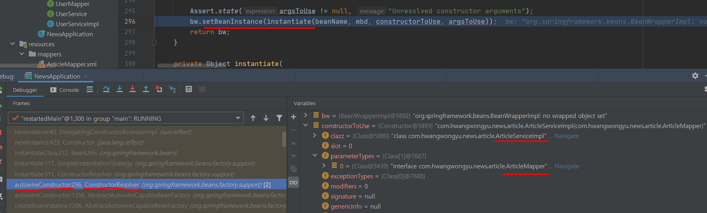

# @Autowired 동작 원리

## @Autowired란?
- 의존관계 주입(DI)을 할 때 사용하는 어노테이션(Annotation)이며, 의존 객체의 타입에 해당하는 빈(Bean)을 찾아 주입하는 역할을 한다.
- 어노테이션이란 필드, 메서드, 클래스에 컴파일 타임과 런타임에 적용될 메타데이터를 말한다.
- 빈이란 스프링이 제어권을 가지고 직접 생성하고 의존관계를 부여하는 오브젝트이다.

## 무엇으로 어떻게 빈을 찾는가?
### BeanPostProcessor
- 빈의 인스턴스가 만들어지는 생명 주기(LifeCycle)가 있는데, BeanPostProcessor는 빈의 초기화(Initialization) 단계의 이전과 이후에 또 다른 부가적인 작업을 할 수 있게 해주는 인터페이스이다.
- 따라서 빈에 접근해야 하기 때문에 당연히 빈을 관리하는 '스프링 컨테이너'에 등록이 되어 있다.
- 💡 참고로 빈의 라이프사이클은 크게 객체생성 - 의존관계 설정 - 초기화 - 소멸 순으로 나눈다.

<p align="center"></p>
 

- 위 그림의 우측에 파란색으로 표시해둔 부분을 보자.
  - 방금 설명한 빈의 초기화 단계의 이전과 이후에 해당하는 postProcessBeforeInitialization 메서드와 postProcessAfterInitialization 메서드가 BeanPostProcessor에 있는 것을 확인할 수 있다.
  - 여기서 초기화 단계의 이전에 동작하는 메서드 덕분에 빈을 찾을 수 있는 것이다.

<p align="center"></p>

- BeanPostProcessor 인터페이스의 실제 코드이다. postProcessBeforeInitialization 메서드를 기억하자.

<p align="center"></p>

- 스프링 공식문서에 적혀있는 빈 라이프사이클이다. 11번 단계와 14번 단계가 BeanPostProcessor와 관련이 있다.
 
### AutowiredAnnotationBeanPostProcessor
- 위에서 설명한 BeanPostProcessor도 결국 구현체가 있어야 메서드를 이용할 수 있는데, @Autowired에 있어서 핵심이 되는 클래스가 바로 AutowiredAnnotationBeanPostProcessor이다.
- 이 또한 빈에 접근해야 하기 때문에 당연히 빈을 관리하는 '스프링 컨테이너'에 등록이 되어 있다.

<p align="center"></p>

- AutowiredAnnotationBeanPostProcessor 클래스는 BeanPostProcessor 인터페이스를 상속받고 있다.

<p align="center"></p>

- 위에서 @Autowired에 대해 설명할 때 필드, 메서드, 클래스에 대해 의존관계 주입을 해준다고 했었다.
- 이를 processInjection 메서드가 빈의 클래스 정보를 읽어와서(getClass()) 자동(auto)으로 의존관계를 설정할 메타데이터를 얻고 주입(inject()) 하는 것이다. 

<p align="center"></p>

- inject 메서드가 객체를 주입할 때 ReflectionUtils라는 클래스를 사용하는 것을 볼 수 있다.
  - 즉, @Autowired는 리플렉션을 통해 수행되는 것이다. 
- 실제로 AutowiredAnnotationBeanPostProcessor는 InjectMetadata를 상속받는 AutowiredFieldElement와 AutowiredMethodElement을 구현하고 있다.
  - 여기서 필드든 메서드든 각각에 맞게 오버라이딩된 inject 메서드가 호출된다.

<p align="center"></p>

- 생성자 메서드를 예제 코드로 했으니 리플렉션 대상은 메서드이다.
- 리플렉션으로 메서드 정보를 makeAccessible 하게 만들어서 method.invoke()로 빈을 주입하는 것이다.
 

### AbstractAutowireCapableBeanFactory
- Bean lifecycle에 따르면 PostProcessor가 빈을 주입하기 전에 당연히 빈이 생성되어 있어야 하고 의존관계가 설정이 되어 있어야 한다.
- @Autowired에 있어서는 AbstractAutowireCapableBeanFactory가 빈의 생성, 빈의 의존관계 주입(DI),
  - BeanFactory는 BeanPostProcessor 타입의 빈을 꺼내 일반적인 빈들을 @Autowired로 의존관계 주입이 필요한 빈들에게 @Autowired를 처리하는 로직을 적용한다.
- 💡 BeanFactory는 스프링 컨테이너의 중심이 되는 인터페이스를 말한다.

```java
@Service
public class ArticleServiceImpl implements ArticleService {

    private final ArticleMapper articleMapper;

    // ArticleMapper 필드를 ArticleServiceImpl 생성자에 Autowiring 하는 것
    @Autowired
    ArticleServiceImpl(ArticleMapper articleMapper) {
        this.articleMapper = articleMapper;
    }
}
```
- 위 코드를 예시로 분석해보자.
  - 생성자 주입 방식으로 ArticleMapper 필드를 ArticleServiceImpl 생성자에 주입받아야 하는 경우이다.

- DefaultListableBeanFactory 클래스의 preInstantiateSingletons 메서드에서 생성자 타입인 articleServiceImpl 빈의 이름을 토대로 빈을 생성하고

<p align="center"></p>
 
- AbstractAutowireCapableBeanFactory 클래스의 createBeanInstance 메서드에서 determineConstructorsFromBeanPostProcessors 메서드로
- Autowire DI 대상이 될 수 있는 생성자 정보(생성자 클래스 ArticleServiceImpl, 파라미터 ArticleMapper)를 받아 반환하고

<p align="center"></p>
 
- ConstructorResolver 클래스의 autowireConstructor 메서드에서 생성자 정보를 토대로 빈을 생성하고 설정해두면

<p align="center"></p>

- 후에 리플렉션 기반으로 생성자 인스턴스를 생성(newInstance)해서 ArticleServiceImpl 생성자에 ArticleMapper를 의존관계를 주입해주는 것이다.

