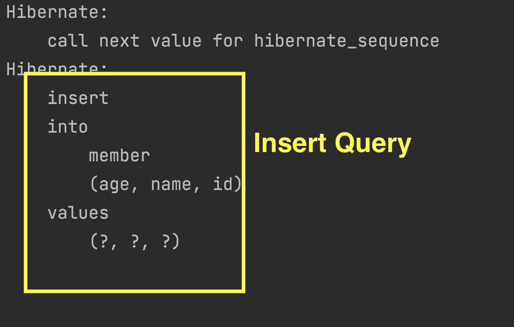
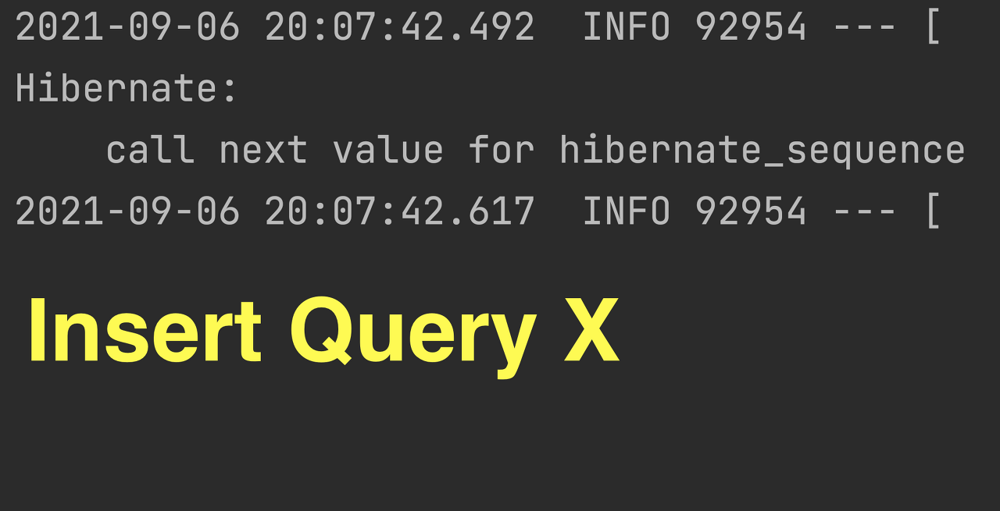
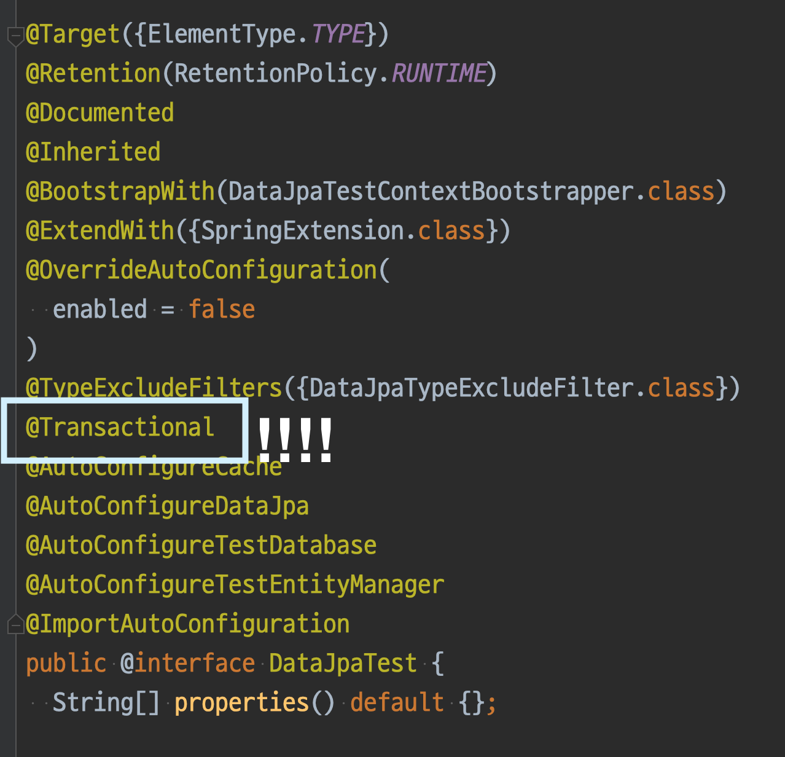

# @SpringBootTest와 @DataJpaTest의 차이점과 JPA 영속성 컨텍스트
## Memory db를 이용한 Repository Test
- Repository layer의 테스트를 위해서 내장 Memory DB를 많이 사용하게 된다.
- 이 때, Memory DB를 사용하는 방법도 천차만별일텐데 크게는 2가지 정도라 볼 수 있다.

```
@SpringBootTest + Memory DB 연결
@DataJpaTest
```

- 두 방법의 차이점과 [Junit & JPA의 영속성 컨텍스트]로 인한 여러 가지 현상에 대해 정확히 알아보자.

## 두 가지 방법의 쿼리 로그가 다르다.
- 위 2가지 방법 중 어느 것을 선택해서 Repository Layer 테스트를 진행할까 고민하던 중 쿼리 로그가 예상과는 다르게 찍히는 것을 확인했다.

### 예제 코드
```java
// Member.java
@Getter
@Setter
@Table(name = "member")
@Entity
public class Member {
    @Id
    @GeneratedValue(strategy = GenerationType.SEQUENCE)
    private long id;

    @Column(name = "name")
    private String name;

    @Column(name = "age")
    private int age;
}


// MemberRepository.java
public interface MemberRepository extends JpaRepository<Member, Long> {

}
```

### @SpringBootTest 코드 & 결과
- 아래 코드처럼 @SpringBootTest를 이용하여 실행해보면 insert query가 실행되는 것을 확인할 수 있다.

```java
@AutoConfigureTestDatabase
@AutoConfigureTestEntityManager
@SpringBootTest
public class TestUsingSpringBootTest {
    @Autowired
    private MemberRepository memberRepository;

    @Test
    void contextLoads() {
        Member member = new Member();
        member.setAge(10);
        member.setName("fdsafdsafa");
        memberRepository.save(member);
    }
}
```
<p align="center"></p>

### @DataJpaTest 코드 & 결과
- 하지만 같은 코드를 @DataJpaTest를 이용하여 실행하면 insert query가 실행되지 않는 것을 확인할 수 있다.

```java
@DataJpaTest
class TestUsingDataJpaTest {
    @Autowired
    private MemberRepository memberRepository;

    @Test
    void contextLoads() {
        Member member = new Member();
        member.setAge(10);
        member.setName("fdsafdsafa");
        memberRepository.save(member);
    }
}
```
<p align="center"></p>

## 이유
### JPA 영속성 컨텍스트의 쿼리 실행 방식
- 영속성 컨텍스트는 flush()가 실행되기 전까지 실행될 쿼리를 가지고 있다가 한 번에 쿼리를 실행하도록 설계되어 있다.
- flush()가 실행되기 전까지 쿼리가 실행되지 않는다는 것은 @Transactional안에서 Rollback이 되어야 하는 상황이라면 애초에 쿼리가 실행조차 되지 않을 수 있다는 것이다.

### JUnit에서의 @Transactional
- JUnit을 통한 Test가 실행된다면 @Transactional이 적용되어 있는 로직이 실행된다면 SELECT를 제외한 모든 쿼리는 Rollback 대상으로 취급한다.
- 위의 이론들을 알고 있는 상태에서 상황별 코드를 다시 자세히 들여다보자.

```java
@DataJpaTest
@DataJpaTest
class TestUsingDataJpaTest {
    @Autowired
    private MemberRepository memberRepository;

    @Test
    void contextLoads() {
        Member member = new Member();
        member.setAge(10);
        member.setName("fdsafdsafa");
        memberRepository.save(member);
    }

}
```

- @DataJpaTest의 경우 쿼리가 Insert Query가 실행되지 않는 것은 @DataJpaTest를 따라가보면 바로 이해할 수 있다.

<p align="center"></p>

- 위에서 보다시피 @DataJpaTest에는 기본적으로 @Transactional이 설정되어 있다.
  - 그러니 @DataJpaTest로 실행한 테스트는 @Transacitonal이 자동으로 설정된다.
- @Transactional이 설정된 상태로 실행된 Test는 userRepository.save()로 영속성 컨텍스트에는 반영되었지만, 결정적으로 쿼리는 나가지 않는 상태가 되기 때문에 로그에도 쿼리가 보이지 않게 된다.

```java
@SpringBootTest
@AutoConfigureTestDatabase
@AutoConfigureTestEntityManager
@SpringBootTest
public class TestUsingSpringBootTest {
    @Autowired
    private MemberRepository memberRepository;

    @Test
    void contextLoads() {
        Member member = new Member();
        member.setAge(10);
        member.setName("fdsafdsafa");
        memberRepository.save(member);
    }
}
```

- @SpringBootTest는 @Trasactional 없이 그대로 돌아가면서 영속성 컨텍스트의 쿼리들이 그대로 실행되므로 쿼리 로그도 확인할 수 있다.

## 여러 응용 실험
### 실험 1. @SpringBootTest + @Transactional
- 위 내용대로라면 @SpringBootTest의 테스트 메소드에 @Transactional을 설정한다면 insert Query가 실행되지 않는 것이 예상된다.
```java
@AutoConfigureTestDatabase
@AutoConfigureTestEntityManager
@SpringBootTest
public class TestUsingSpringBootTest {
    @Autowired
    private MemberRepository memberRepository;

    @Transactional
    @Test
    void contextLoads() {
        Member member = new Member();
        member.setAge(10);
        member.setName("fdsafdsafa");
        memberRepository.save(member);
    }
}
```

### 실험 2. @SpringBootTest + @Transactional + Rollback(false)
- @Rollback(false)는 테스트 코드에서 자동으로 설정되는 Rollback의 실행을 강제로 설정할 수 있는 어노테이션이다.
- @SpringBootTest와 @Transactional을 설정한다고 해도 @Rollback(false)를 사용하게 되면 insert query의 실행이 예상이 되고 아래 코드는 예상된 결과대로 동작하는 것을 확인할 수 있다.
  - (@DataJpaTest + @Rollback(false)의 결과도 역시 동일하다.)

```java
@AutoConfigureTestDatabase
@AutoConfigureTestEntityManager
@SpringBootTest
public class TestUsingSpringBootTest {
    @Autowired
    private MemberRepository memberRepository;

        @Rollback(false)
        @Transactional
    @Test
    void contextLoads() {
        Member member = new Member();
        member.setAge(10);
        member.setName("fdsafdsafa");
        memberRepository.save(member);
    }
}
```

## GenerationType.IDENTITY의 테스트
### Entity의 @GeneratedValue만 변경했는데 결과가 다르다
- 위 예제들에서는 기본키 생성 방식을 GenerationType.Sequence 로 테스트를 진행했었는데 GenerationType.IDENTITY 로 진행하면 또 다른 결과가 나오게 된다.
- 생성 방식만 변경하여 @DataJpaTest 방식의 동일한 테스트를 진행해보자.

```java
// Member.java
@Getter
@Setter
@Table(name = "member")
@Entity
public class Member {
    @Id
    @GeneratedValue(strategy = GenerationType.IDENTITY)
    private long id;

    @Column(name = "name")
    private String name;

    @Column(name = "age")
    private int age;
}


@DataJpaTest
class TestUsingDataJpaTest {
    @Autowired
    private MemberRepository memberRepository;

    @Test
    void contextLoads() {
        Member member = new Member();
        member.setAge(10);
        member.setName("fdsafdsafa");
        memberRepository.save(member);
    }
}
```

- 분명 @DataJpaTest는 자동으로 @Transactional이 설정되어 있기 때문에 insert query가 실행되지 않아야 한다.
- 그런데 GenerationType.Sequence → GenerationType.IDENTITY 로 생성 방식만 변경했을 뿐인데 insert query가 실행된 것을 확인할 수 있다.

### 다시 JPA 영속성 컨텍스트
- userRepository.save() 를 이용해 영속성 컨텍스트에 담는 과정을 생각해보면 왜 insert query가 실행되었는지 알 수 있다.

### GenerationType.Sequence
- Entity를 영속성 컨텍스트에 담기 위해서는 ID를 포함한 값이 Entity가 담겨있어야 한다.
  - 결국 영속성 컨텍스트에 담기 위해서는 ID 값을 생성해야 한다는 뜻인데
  - GenerationType.Sequence는 별도의 쿼리를 통해 ID 값만 가져오기 때문에 flush()가 실행되기 전까지는 따로 insert query가 실행되지는 않는다.

### GenerationType.IDENTITY
- GenerationType.IDENTITY 는 보통 auto_increment로 동작하고 insert 하기 전에는 ID 값을 알 수 없는 상태이기 때문에 영속성 컨텍스트에 담지 못한다.
  - 결국 해당 Entity의 ID를 알아내기 위해 save()와 동시에 insert query를 실행하게 된다.
- insert query가 실행되는 이유는 결국 GenerationType.IDENTITY로 설정된 Entity의 save()에서 실행된 insert query는 영속화 과정 중 ID 값 생성을 위한 insert query이다.
