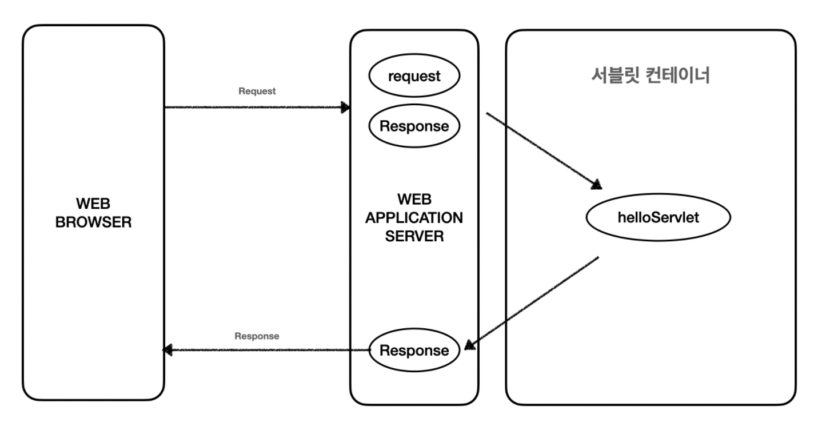
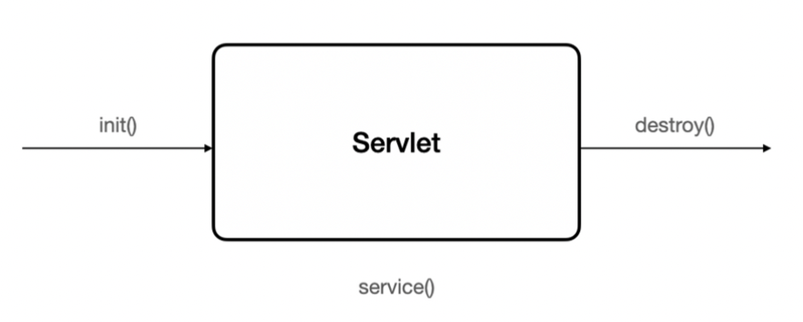
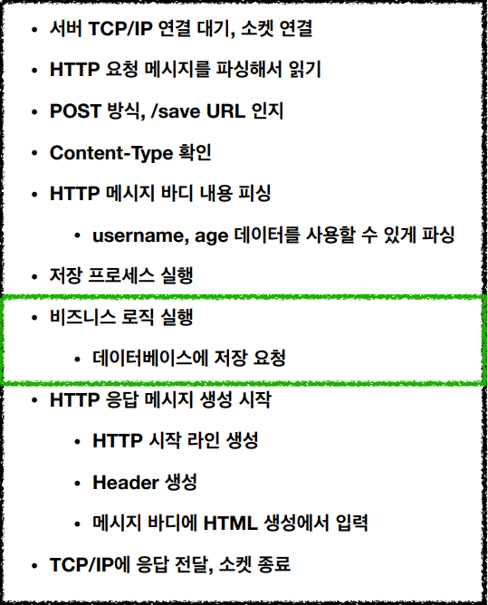
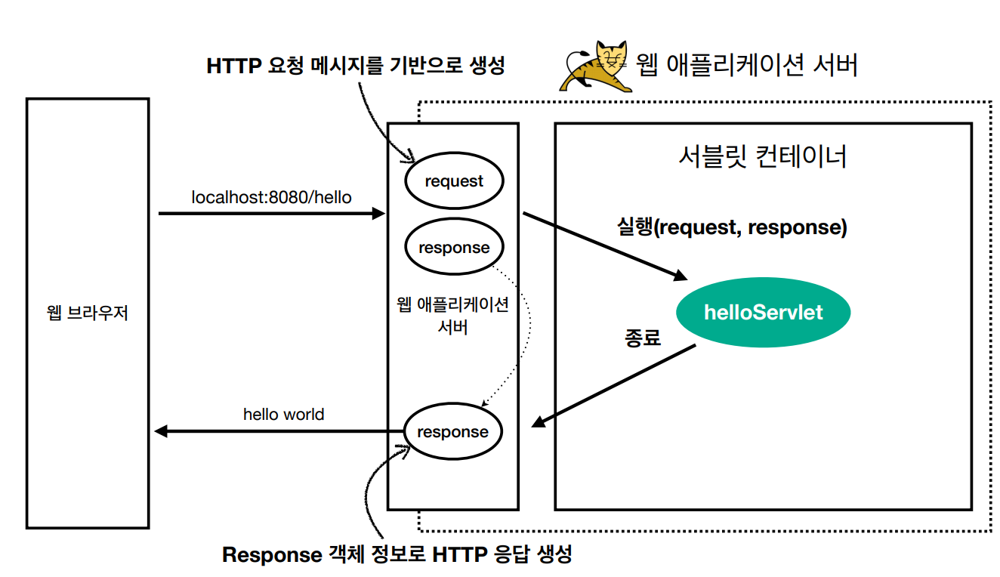
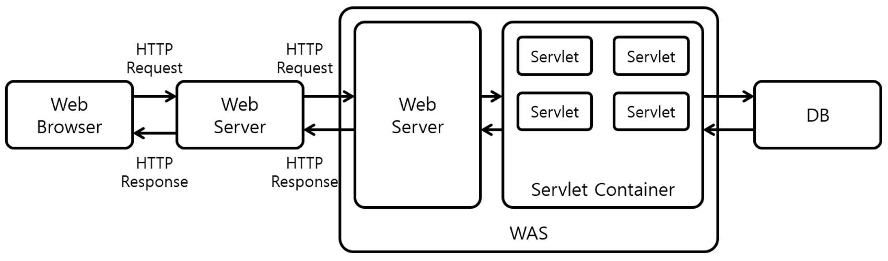
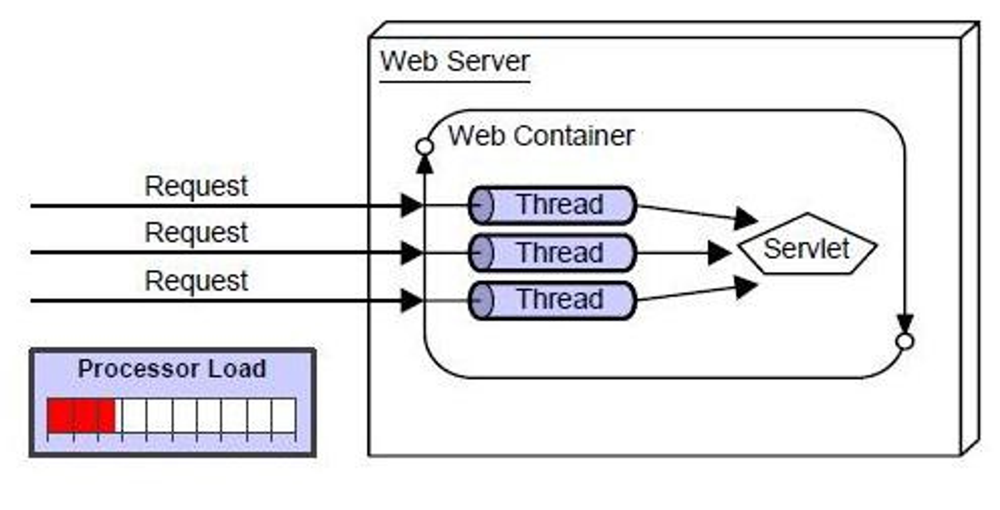

# Servlet & Servlet Container
## Servlet
- 서블릿은 클라이언트 요청을 처리하고, 그 결과를 다시 클라이언트에게 전송하는 Servlet 클래스의 구현 규칙을 지킨 자바 프로그램이다.
- 이전의 웹 프로그램들은 클라이언트의 요청에 대한 응답으로 만들어진 페이지를 넘겨 주었으나, 현재는 동적인 페이지를 가공하기 위해서 웹 서버가 다른 곳에 도움을 요청한 후 가공된 페이지를 넘겨주게 된다.
- 이 때 서블릿을 사용하게 되면 웹 페이지를 동적으로 생성하여 클라이언트에게 반환해줄 수 있다.

### Servlet의 예시
```java
@WebServlet(name = "helloServlet", urlPatterns = "/hello")
public class HelloServlet extends HttpServlet {

    @Override
    protected void service(HttpServletRequest request, HttpServletResponse response) throws ServletException, IOException {
        // 애플리케이션 로직
    }
}
```

- urlPatterns("/hello") 의 URL이 호출되면 서블릿 코드가 실행된다.
- HttpServletRequest를 통해 HTTP 요청 정보를 사용할 수 있다.
- HttpServletResponse를 통해 HTTP 응답 정보를 사용할 수 있다.

### Servlet의 동작 방식
<p align="center"></p>

- 사용자가 URL을 입력하면 요청이 서블릿 컨테이너로 전송된다.
- 요청을 전송받은 서블릿 컨테이너는 HttpRequest, HttpResponse 객체를 생성한다.
- 사용자가 요청한 URL이 어느 서블릿에 대한 요청인지 찾는다.
     - 위 예제에서는 helloServlet을 찾게 된다.
- 서블릿의 service() 메소드를 호출한 후 클라이언트의 GET, POST 여부에 따라 doGet(), doPost() 메소드를 호출한다.
- 동적 페이지를 생성한 후 HttpServletResponse 객체에 응답을 보낸다.
- 클라이언트에 최종 결과를 응답한 후 HttpServletRequest, HttpServletResponse 객체를 소멸한다.
 
### Servlet의 생명 주기
<p align="center"></p>

- 클라이언트 요청이 들어오면 서블릿 컨테이너는 서블릿이 메모리에 있는지 확인한다.
  - 메모리에 없다면 init() 메소드를 호출하여 적재한다.
- 클라이언트 요청에 따라서 service() 메소드를 통해 요청에 대한 응답이 doGet(), doPost()로 분기한다.
- 서블릿 컨테이너가 서블릿에 종료 요청을 하면 destory() 메소드가 호출된다.
  - 종료 시 처리해야 하는 작업은 destory() 메소드를 오버라이딩하여 구현하면 된다.
  - destory() 메소드가 끝난 서블릿 인스턴스는 GC에 의해 제거된다.
 
### 일반 자바 객체와의 차이점
- JVM에서 호출 방식은 서블릿과 일반 클래스 모두 같으나, 서블릿은 main() 메소드로 직접 호출되지 않고, 웹 컨테이너(Servlet Container)에 의해 실행된다.
- 컨테이너가 web.xml을 읽고, 서블릿 클래스를 클래스 로더에 등록하는 절차를 밟는다.

## 서블릿 컨테이너
- 서블릿 컨테이너는 구현되어 있는 Servlet 클래스의 규칙에 맞게 서블릿 객체를 생성, 초기화, 호출, 종료하는 생명 주기를 관리한다.
  - 서블릿 컨테이너는 클라이언트의 요청을 받고 응답할 수 있도록 웹 서버와 소켓으로 통신한다.
- Tomcat은 웹 애플리케이션(WAS) 중 하나로, Servlet Container 기능을 제공하고 있다.
- 혹자는 Tomcat을 서블릿 컨테이너라고 부르긴 하지만, 엄밀히 말하면 내장 웹 서버 등의 부가 기능도 제공하므로 WAS라고 부르는 것이 좋다고 생각한다.

### 서블릿 컨테이너의 특징
#### 1) 통신 지원
- 서블릿과 웹 서버가 통신할 수 있는 손쉬운 방법을 제공한다.
- 만약 해당 유저의 이름 값을 FORM을 통해 입력받는다고 가정해보자. 그러면 아래와 같은 수많은 작업이 필요하다.

<p align="center"></p>
 
- FORM 인증을 하면 HTTP 메시지가 전송되는데 그것을 읽어들이기 위해 여러 가지 과정을 거쳐야 하고 응답하기 위해서도 또 번거로운 과정들을 거쳐야 한다.
  - 사실 중요하게 해야할 일은 비즈니스 로직인데도 말이다.
- 서블릿은 개발자가 비즈니스 로직에 집중할 수 있도록 해당 과정을 모두 자동으로 해준다.
  - 우리는 단순히 HTTP 요청 메시지로 생성된 request를 읽어서 비즈니스 로직을 수행하고 response를 반환하면 된다.

<p align="center"></p>

- 좀 더 구체적으로 해당 흐름을 설명하자면,
- 먼저, 특정 URL이 호출되면 서블릿 코드가 실행되면서 HTTP 요청 메시지를 기반으로 HttpServletRequest(request)를 생성한다.
- 그리고 개발자는 여러가지 비즈니스 로직을 거친 뒤 서블릿이 제공하는 HttpServletResponse를 활용하여 HTTP 응답 (response)를 생성할 수 있다.

#### 2) 서블릿의 생명 주기를 관리
- 서블릿 클래스를 로딩해 인스턴스화하고, 서블릿의 초기화 메소드를 호출하고, 요청이 들어오면 적절한 서블릿 메소드를 호출하는 작업을 서블릿 컨테이너가 한다.
- 서블릿의 사용이 끝난 시점에는 가비지 컬렉션을 진행해 제거한다.

#### 3) 멀티 스레딩 관리
- 서블릿 컨테이너는 요청이 올 때마다 새로운 자바 스레드를 하나 생성하여 다중 처리하고, 실행이 끝나면 자동으로 종료된다.

#### 4) 선언적 보안 관리
- 보안 관련 설정을 배포 서술자라는 xml 문서를 활용하여 관리하므로 개발자가 보안 설정을 바꾸더라도 자바 코드에 영향이 가지 않는다.

#### 5) JSP 지원
- JSP 코드를 자바 코드로 변환해 준다.

### 서블릿 컨테이너 동작 과정
<p align="center"></p>

1. 웹 브라우저에서 웹 서버에 HTTP 요청을 보내면, 웹 서버는 받은 HTTP 요청을 WAS의 Web Server로 전달한다.
2. WAS의 웹 서버는 HTTP 요청을 서블릿 컨테이너에 전달한다.
3. 서블릿 컨테이너는 HTTP 요청 처리에 필요한 서블릿 인스턴스가 힙 메모리 영역에 있는지 확인한다.
    1. 존재하지 않는다면, 서블릿 인스턴스를 생성하고 해당 서블릿 인스턴스의 init() 메소드를 호출하여 서블릿 인스턴스를 초기화한다.
4. 서블릿 컨테이너는 서블릿 인스턴스의 service() 메소드를 호출하여 HTTP 요청을 처리하고, WAS의 웹 서버에게 처리 결과를 전달한다.
5. WAS의 웹 서버는 HTTP 응답을 앞 단에 위치한 웹 서버에게 전달하고, 앞 단의 웹 서버는 받은 HTTP 응답을 웹 브라우저에게 전달한다.
 
### 멀티 스레딩 부가 설명
- 위에서 서블릿 컨테이너는 요청이 올 때마다 새로운 자바 스레드를 하나씩 생성한다고 하였다.
- 여기서 유의할 점은 요청이 올 때마다 해당 서블릿의 스레드를 생성하는 것이지, 서블릿 인스턴스 자체를 새로 생성하는 것이 아니다.

<p align="center"></p>

- 서블릿 인스턴스는 싱글톤으로 생성되며, Thread-Safe 하지 않기 때문에 서블릿은 무상태 혹은 읽기 전용 상태, 동기화 처리된 구조로 설계되어야 한다.
- 그렇다면, 서블릿 컨테이너는 사용자 요청이 올 때마다 무한정 스레드를 생성할까?
    - 그렇지 않다. 내부에 스레드 풀이 있으므로 전체 스레드 수를 조절한다.


