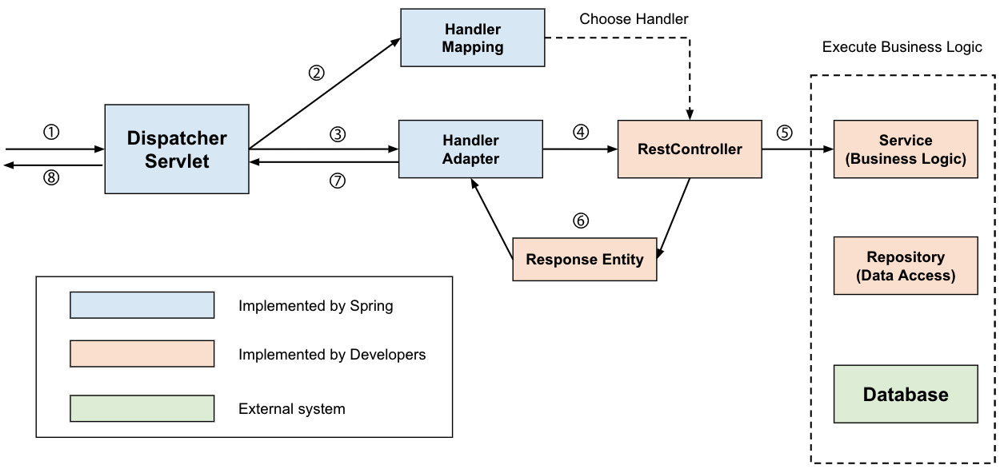
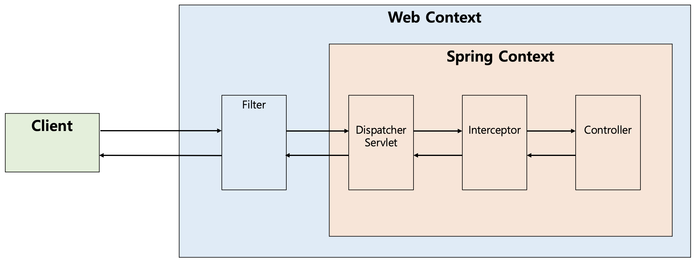

# 디스패처 서블릿
## 1. Dispatcher-Servlet(디스패처 서블릿)의 개념
- 디스패처 서블릿의 dispatch는 "보내다" 라는 뜻을 가진다.
- 이러한 단어를 포함하는 디스패처 서블릿은 HTTP 프로토콜로 들어오는 모든 요청을 가장 먼저 받아 적합한 컨트롤러에 위임해주는 __프론트 컨트롤러(Front Controller)__ 라고 정의할 수 있다.
  - 이를 보다 자세히 설명하자면, 클라이언트로부터 어떠한 요청이 오면 Tomcat(톰캣)과 같은 서블릿 컨테이너가 요청을 받게 된다.
  - 그리고 이 모든 요청을 프론트 컨트롤러인 디스패처 서블릿이 가장 먼저 받게 된다.
  - 그러면 디스패처 서블릿은 공통적인 작업을 먼저 처리한 후에 해당 요청을 처리해야 하는 컨트롤러를 찾아서 작업을 위임한다.
- Front Controller는 주로 서블릿 컨테이너의 제일 앞에서 서버로 들어오는 클라이언트의 모든 요청을 받아서 처리해주는 컨트롤러로써, MVC 구조에서 함께 사용되는 디자인 패턴이다.

## 2. Dispatcher-Servlet(디스패처 서블릿)의 장점
- Spring MVC는 DispatcherServlet이 등장함에 따라 web.xml의 역할을 상당히 축소시켜 주었다.
  - 과거에는 모든 서블릿을 URL 매핑을 위해 web.xml에 모두 등록해주어야 했다.
  - Dispatcher-Servlet이 해당 어플리케이션으로 들어오는 모든 요청을 핸들링해주고 공통 작업을 처리면서 상당히 편리하게 이용할 수 있게 되었다.
- 개발자 입장에서는 컨트롤러를 구현해두기만 하면 디스패처 서블릿가 알아서 적합한 컨트롤러로 위임을 해주는 구조가 되었다.

## 3. 정적 자원(Static Resources)의 처리 
- Dispatcher Servlet이 요청을 Controller로 넘겨주는 방식은 효율적으로 보인다.
- 하지만 Dispatcher Servlet이 모든 요청을 처리하다보니 이미지나 HTML/CSS/JavaScript 등과 같은 정적 파일에 대한 요청마저 모두 가로채는 까닭에 정적 자원(Static Resources)을 불러오지 못하는 상황도 발생하곤 했다.
- 이러한 문제를 해결하기 위해 개발자들은 2가지 방법을 고안했다.
  - 정적 자원 요청과 애플리케이션 요청을 분리
  - 애플리케이션 요청을 탐색하고 없으면 정적 자원 요청으로 처리
 
### 1) 정적 자원 요청과 애플리케이션 요청을 분리
- 해당 방법은 클라이언트의 요청을 2가지로 분리하여 구분하는 것이다.
  - /apps의 URL로 접근하면 Dispatcher Servlet이 담당한다.
  - /resources의 URL로 접근하면 Dispatcher Servlet이 컨트롤할 수 없으므로 담당하지 않는다.
- 이러한 방식은 괜찮지만 상당히 코드가 지저분해지며, 모든 요청에 대해서 저런 URL을 붙여주어야 하므로 직관적인 설계가 될 수 없다.
  - 따라서, 다음의 방법으로 처리를 하게 된다.

### 2) 애플리케이션 요청을 탐색하고 없으면 정적 자원 요청으로 처리
- 해당 방법은 Dispatcher Servlet이 요청을 처리할 컨트롤러를 먼저 찾고, 요청에 대한 컨트롤러를 찾을 수 없는 경우에 2차적으로 설정된 자원(Resource) 경로를 탐색하여 자원을 탐색하는 것이다.
- 이렇게 영역을 분리하면 효율적인 리소스 관리를 지원할 뿐 아니라 추후에 확장을 용이하게 해준다는 장점이 있다.


## 4. Dispatcher-Servlet(디스패처 서블릿)의 동작 과정
- 앞서 설명한대로 디스패처 서블릿은 적합한 컨트롤러와 메소드를 찾아 요청을 위임해야 한다.
- Dispatcher Servlet의 처리 과정을 살펴보면 다음과 같다.

<p align="center"></p>
 
```
1) 클라이언트의 요청을 디스패처 서블릿이 받음
2) 요청 정보를 통해 요청을 위임할 컨트롤러를 찾음
3) 요청을 컨트롤러로 위임할 핸들러 어댑터를 찾아서 전달함
4) 핸들러 어댑터가 컨트롤러로 요청을 위임함
5) 비즈니스 로직을 처리함
6) 컨트롤러가 반환값을 반환함
7) 핸들러 어댑터가 반환값을 처리함
8) 서버의 응답을 클라이언트로 반환함
```
 

### 1) 클라이언트의 요청을 디스패처 서블릿이 받음
- 앞서 설명했듯 디스패처 서블릿은 가장 먼저 요청을 받는 프론트 컨트롤러이다.
- 서블릿 컨텍스트(웹 컨텍스트)에서 필터들을 지나 스프링 컨텍스트에서 디스패처 서블릿이 가장 먼저 요청을 받게 된다.
- 이를 그림으로 표현하면 다음과 같다.
  - 실제로는 Interceptor가 Controller로 요청을 위임하지는 않으므로, 아래의 그림은 처리 순서를 도식화한 것으로만 이해하면 된다.

<p align="center"></p>

### 2) 요청 정보를 통해 요청을 위임할 컨트롤러를 찾음
- 디스패처 서블릿은 요청을 처리할 핸들러(컨트롤러)를 찾고 해당 객체의 메소드를 호출한다.
- 따라서 가장 먼저 어느 컨트롤러가 요청을 처리할 수 있는지를 식별해야 하는데, 해당 역할을 하는 것이 바로 __HandlerMapping__ 이다.
- 최근에는 @Controller에 @RequestMapping 관련 어노테이션을 사용해 컨트롤러를 작성하는 것이 일반적이다.
  - 하지만 예전 스펙을 따라 Controller 인터페이스를 구현하여 컨트롤러를 작성할 수도 있다.
  - 즉, 컨트롤러를 구현하는 방법이 다양하기 때문에 스프링은 HandlerMapping 인터페이스를 만들어두고, 구현 방법에 따라 요청을 처리할 대상을 찾도록 되어 있다.
- 오늘날 흔한 @Controller 방식은 RequestMappingHandlerMapping이 처리한다.
  - 이는 @Controller로 작성된 모든 컨트롤러를 찾고 파싱하여 HashMap으로 <요청 정보, 처리할 대상>을 관리한다.
  - 여기서 처리할 대상은 HandlerMethod 객체로 컨트롤러, 메소드 등을 갖고 있는데, 이는 스프링이 리플렉션을 이용해 요청을 위임하기 때문입니다.
  - 그래서 요청이 오면 (Http Method, URI) 등을 사용해 요청 정보를 만들고, HashMap에서 요청을 처리할 대상(HandlerMethod)를 찾은 후에 HandlerExecutionChain으로 감싸서 반환한다.
  - HandlerExecutionChain으로 감싸는 이유는 컨트롤러로 요청을 넘겨주기 전에 처리해야 하는 인터셉터 등을 포함하기 위해서이다.

### 3) 요청을 컨트롤러로 위임할 핸들러 어댑터를 찾아서 전달함
- 이후에 컨트롤러로 요청을 위임해야 하는데, 디스패처 서블릿은 컨트롤러로 요청을 직접 위임하는 것이 아니라 HandlerAdapter를 통해 위임한다.
  - 그 이유는 앞서 설명하였듯 컨트롤러의 구현 방식이 다양하기 때문이다.
- 스프링은 꽤나 오래 전에(2004년) 만들어진 프레임워크로, 트렌드를 굉장히 잘 따라간다.
  - 프로그래밍 흐름에 맞게 스프링 역시 변화를 따라가게 되었는데, 그러면서 다양한 코드 작성 방식을 지원하게 되었다.
  - 과거에는 컨트롤러를 Controller 인터페이스로 구현하였는데, Ruby On Rails가 어노테이션 기반으로 관례를 이용한 프로그래밍을 내세워 혁신을 일으키면서 스프링 역시 이를 도입하게 되었다.
- 그래서 다양하게 작성되는 컨트롤러에 대응하기 위해 스프링은 HandlerAdapter라는 어댑터 인터페이스를 통해 어댑터 패턴을 적용함으로써 컨트롤러의 구현 방식에 상관없이 요청을 위임할 수 있도록 하였다.

### 4) 핸들러 어댑터가 컨트롤러로 요청을 위임함
- 핸들러 어댑터가 컨트롤러로 요청을 위임한 전/후에 공통적인 전/후처리 과정이 필요하다.
  - 대표적으로 인터셉터들을 포함해 요청 시에 @RequestParam, @RequestBody 등을 처리하기 위한 ArgumentResolver들과
  - 응답 시 ResponseEntity의 Body를 Json으로 직렬화하는 등의 처리를 하는 ReturnValueHandler 등이 핸들러 어댑터에서 처리된다.
- ArgumentResolver 등을 통해 파라미터가 준비되면 리플렉션을 이용해 컨트롤러로 요청을 위임한다.
- 요청을 처리할 대상 정보인 HandlerMethod 객체에는 컨트롤러와 메소드 객체가 있으므로 리플렉션의 메소드 객체를 invoke 한다.
- 사실 실제로는 HandlerMethod에 컨트롤러 빈 이름과 메소드, 빈 팩토리가 있어서 빈 팩토리에서 컨트롤러 빈을 찾게 된다.
- 그리고 해당 컨트롤러 빈 객체로부터 리플렉션을 사용하게 된다.
 

### 5) 비지니스 로직을 처리함
- 이후에 컨트롤러는 서비스를 호출하고 우리가 작성한 비지니스 로직들이 진행된다.

### 6) 컨트롤러가 반환값을 반환함
- 비지니스 로직이 처리된 후에는 컨트롤러가 반환값을 반환한다.
- 응답 데이터를 사용하는 경우에는 주로 ResponseEntity를 반환하게 되고, 응답 페이지를 보여주는 경우라면 String으로 View의 이름을 반환할 수도 있다.
- 요즘 프론트엔드와 백엔드를 분리하고, MSA로 가고 있는 시대에서는 주로 ResponseEntity를 반환한다.

### 7) 핸들러 어댑터가 반환값을 처리함
- HandlerAdapter는 컨트롤러로부터 받은 응답을 응답 처리기인 ReturnValueHandler가 후처리한 후에 디스패처 서블릿으로 돌려준다.
- 만약 컨트롤러가 ResponseEntity를 반환하면 HttpEntityMethodProcessor가 MessageConverter를 사용해 응답 객체를 직렬화하고 응답 상태(HttpStatus)를 설정한다.
- 만약 컨트롤러가 View 이름을 반환하면 ViewResolver를 통해 View를 반환한다.

 
### 8) 서버의 응답을 클라이언트로 반환함
- 디스패처 서블릿을 통해 반환되는 응답은 다시 필터들을 거쳐 클라이언트에게 반환된다.
- 이 때 응답이 데이터라면 그대로 반환되지만, 응답이 화면이라면 View의 이름에 맞는 View를 찾아서 반환해주는 ViewResolver가 적절한 화면을 내려준다.


