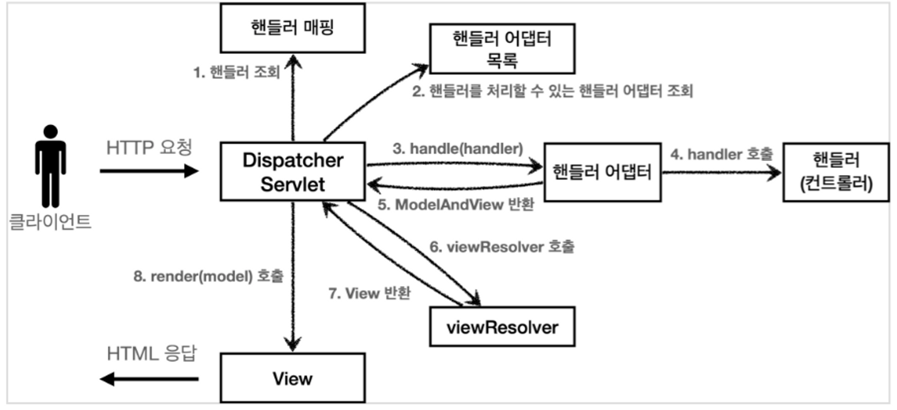

# 스프링 MVC
## Spring MVC 동작 순서
<p align="center"></p>

1. 핸들러 조회 : 핸들러 매핑을 통해 URL에 매핑된 핸들러(컨트롤러) 조회
2. 핸들러 어댑터 조회: 핸들러를 실행할 수 있는 핸들러 어댑터 조회
3. 핸들러 어댑터 실행: 핸들러 어댑터 실행
4. 핸들러 실행: 핸들러 어댑터가 실제 핸들러를 실행
5. ModelAndView 반환: 핸들러 어댑터는 핸들러가 반환하는 정보를 ModelAndView로 변환해 반환.
6. viewResolver 호출: 뷰 리졸버를 찾아 실행한다. 
    1. JSP: InternalResourceViewResolver가 자등 등록되어 사용된다.
7. View 반환: 뷰 리졸버는 뷰의 논리 이름을 물이 이름으로 바꾸고 렌더링 역할을 담당하는 뷰 객체 반환.
    1. JSP: InternalResourceView(JstlView)를 반환하는데, 내부에는 forward() 가 있다. 
8. 뷰 렌더링: 뷰를 통해서 뷰를 렌더링한다.

## 인터페이스 살펴보기
- Spring MVC는 DispatcherServlet 코드 변경을 하지 않고도 원하는 기능을 변경하거나 확장할 수 있다.
- 그리고 이런 인터페이스들을 구현해 DispatcherServlet에 등록하면 커스텀 컨트롤러를 만들 수도 있다.

### 주요 인터페이스 목록
- 핸들러 매핑: org.springframework.web.servlet.HandlerMapping
- 핸들러 어댑터: org.springframework.web.servlet.HandlerAdapter
- 뷰 리졸버: org.springframework.web.servlet.ViewResolver
- 뷰: org.springframework.web.servlet.View

---
- 이처럼 spring MVC의 구조와 흐름에 대해 몰라도 기본적인 사용법만 익혀서 애노테이션만 사용하면 서버를 구현하는데 어려움이 없고,
  - 대부분의 기능은 수년 간 이미 다 구현되고 확장되었기에 직접 구현할 일은 거의 없다. 
- 하지만, 이런 내부 로직과 흐름에 대해 이해한다면 프로젝트에 문제가 생겼을 시 디버깅을 할 때 몹시 유리하다.
  - 특정 컨트롤러에서 반환하는 ViewName을 제대로 찾지 못해 페이지가 안 나온다고 가정하자.
  - 이런 흐름이나 인터페이스를 전혀 모른다면 어디서부터 손대야 할지 모르지만, 안다면 뷰 리졸버부터 확인하며 어떻게 물리적 이름이 완성되는지부터 확인할 수 있다.
- 또한 기능을 구현하는 것은 아닐지라도 기능의 확장이 필요할 때 어디를 확장해야 하는지에 대해서도 구조를 아는 것과 모르는 것의 차이는 크다. 

## 핸들러 매핑과 핸들러 어댑터
- 핸들러 매핑과 핸들러 어댑터를 단순하게 Map, List Collection을 이용해서 등록한 뒤 검색해서 사용하는 방법을 생각할 수 있다.
- 그렇다면 spring MVC에서는 어떻게 핸들러 매핑과 핸들러 어댑터를 사용하는지 알아보자. 

### Controller 인터페이스
- 과거 버전의 스프링 컨트롤러 인터페이스 : org.springframework.web.servlet.mvc.Controller
- Controller 인터페이스를 구현해 간단하게 핸들러 매핑 테스트를 진행해보자. 

#### Controller 인터페이스를 구현하는 OldController
```java
package hello.servlet.web.springmvc.old;

import org.springframework.stereotype.Component;
import org.springframework.web.servlet.ModelAndView;
import org.springframework.web.servlet.mvc.Controller;

import javax.servlet.http.HttpServletRequest;
import javax.servlet.http.HttpServletResponse;

@Component("/springmvc/old-controller")
public class OldController implements Controller {
    @Override
    public ModelAndView handleRequest(HttpServletRequest request, HttpServletResponse response) throws Exception {
        System.out.println("OldController.handleRequest");
        return null;
    }
}
```

- @Controller 애노테이션과는 다르다. 
- @Component("/springmvc/old-controller")
  - /springmvc/old-controller 라는 이름의 스프링 빈으로 등록되었다. 
  - 스프링 빈의 이름으로 URL 매핑을 할 것이다.  

### 동작 확인
- 접속 URL: http://localhost:8080/springmvc/old-controller
  - 어떻게 URL을 통해 해당 컨트롤러를 찾을 수 있는 것인가?
- 해당 컨트롤러가 호출되기 위해서는 2가지가 필요하다.

#### HandlerMapping
- 핸들러 매핑에서 이 컨트롤러를 찾을 수 있어야 한다.
- 스프링 빈의 이름으로 핸들러를 찾을 수 있는 핸들러 매핑이 필요하다.

#### HandlerAdapter
- 핸들러 매핑을 통해 찾은 핸들러를 실행할 수 있는 핸들러 어댑터가 필요하다. 
- Controller 인터페이스를 실행할 수 있는 핸들러 어댑터를 찾아야 한다. 

### 스프링 부트에서의 핸들러 매핑과 핸들러 어댑터
- 스프링 부트에서는 자동으로 핸들러 매핑과 핸들러 어댑터를 등록해준다.
  - 아주 다양하게 등록되지만, 여기서는 위 예제에 맞는 몇 가지만 작성한다. 

##### HandlerMapping
```
0 = RequestMappingHandlerMapping : 애노테이션 기반의 컨트롤러인 @Requestmapping에서 사용한다. 
1 = BeanNameUrlHandlerMapping    : 스프링 빈의 이름으로 핸들러를 찾는다.
```
#### HandlerAdapter
```
0 = RequestmappingHandlerAdapter  : 애노테이션 기반의 컨트롤러인 @Requestmapping에서 사용한다. 
1 = HttpRequestHandlerAdapter     : HttpRequesthandler 처리
2 = SimpleControllerHandlerAdapter: Controller 인터페이스(애노테이션 X) 처리 
```

- 핸들러 매핑, 핸들러 어댑터 모두 순서대로 찾고 만약 없을 경우 다음 순서로 넘어간다. 
- 위 내용을 토대로 정리해보면 우리가 작성한 OldController는 웹 브라우저에서 URL 요청시 다음과 같이 매핑되어 수행된다. 

##### 1. 핸들러 매핑으로 핸들러 조회
: HandlerMapping에서 순서대로 수행하는데 BeanNameUrlHandlerMapping에서 검색이 되기에 해당 URL을 빈 이름으로 등록한 핸들러(OldController)가 매핑되어 반환된다.
##### 2. 핸들러 어댑터 조회
: 어댑터를 순서대로 호출하며 이전에 찾은 핸들러(OldController)가 실행 가능한 어댑터를 찾는다. 이 중에서 SimpleControllerHandlerAdapter가 Controller 인터페이스를 실행 가능하기에 반환된다. 
##### 3. 핸들러 어댑터 실행
: 반환된 어댑터(SimpleControllerHandlerAdapter)를 실행하면서 핸들러 정보를 넘겨주고 그 결과를 반환한다. 


## 뷰 리졸버
- View의 논리 이름을 물리 이름으로 완성시켜주는 뷰 리졸버를 spring MVC에서는 어떻게 만들어줄까? 
- 위에서 만든 Old Controller는 현재는 반환값이 null이라 URL을 요청해도 어떤 화면도 안 나오지만 이제 조회가 되도록 변경해보자. 

### OldController - View 조회 되도록 변경
```java
@Override
public ModelAndView handleRequest(HttpServletRequest request, HttpServletResponse response) throws Exception {
    System.out.println("OldController.handleRequest");
    return new ModelAndView("new-form");
}
```

- View를 사용할 수 있도록 new ModelAndView("new-form")을 반환해준다. 
- 그럼 이제 다시 http://localhost:8080/springmvc/old-controller 경로로 접속해서 동작이 되는지 확인을 해보자. 정상적으로 나오는가?
  - 아마 여전히 컨트롤러 호출은 되지만 페이지는 나오지 않을 것이다. 
  - 그 이유는 new-form 이라는 viewPath를 물리 이름으로 완성하기 위해선 어떤 경로인지 상위 경로 prefix와 이게 html인지 jsp인지 확장자를 저장한 suffix가 없기 때문이다. 
- 그렇기에 application.properties 라는 속성 파일에 다음 코드를 추가한다. 
```
spring.mvc.view.prefix=/WEB-INF/views/
spring.mvc.view.suffix=.jsp
```
- 다시 구동해보면 이제 정상적으로 페이지가 노출될 것이다. 

### 뷰 리졸버 동작 방식
<p align="center"></p>

- 6번, 7번 과정에서 뷰 리졸버가 동작한다. 
- 스프링 부트는 구동 시 자동 등록되는 뷰 리졸버가 많은데, 이 중 대표적인 것은 다음과 같다. 

```
1 = BeanNameViewResolver         : 빈 이름으로 뷰를 찾아 반환한다. 
2 = InternalResourceViewResolver : JSP를 처리할 수 있는 뷰를 반환한다.
```

- 여기서 이번 OldController에 동작하는 뷰 리졸버는 무엇일까?
  - 우선 new-form으로 등록된 Bean은 없다.
  - 그렇기에 다음으로 InternalResourceViewResolver가 호출된다. 

#### 1) 핸들러 어댑터 호출
- 핸들러 어댑터를 통해 new-form 이라는 논리 뷰 이름을 획득한다.
#### 2) ViewResolver 호출
- new-form 이라는 뷰 이름으로 viewResolver를 순서대로 호출한다. 
- BeanNameViewResolver는 new-form이라는 이름의 스프링 빈으로 등록된 뷰를 찾는데 없다. 
- InternalResourceViewResolver가 호출된다.
#### 3) InternalResourceViewResolver
- 이 뷰 리졸버는 InternalResourceView를 반환한다.
#### 4) 뷰 - InternalResourceView
- InternalResourceView 는 JSP 처럼 forwrad()를 호출해서 처리할 수 있는 경우 사용한다.
#### 5) view.render()
- view.render()가 호출되고 InternalResourceView는 forward()를 사용해 JSP를 실행한다.

##### 참고: JSTL 라이브러리가 있는 경우
- InternalResourceViewResolver는 JSTL 라이브러리가 있으면 InternalResourceView를 상속받은 JstlView를 반환한다.
- JstlView는 JSTL 태그 사용시 약간의 부가기능이 추가된다. 
##### 참고: 렌더링
- 다른 뷰는 실제 뷰를 렌더링하지만, JSP는 forward() 를 통해 해당 JSP로 이동해야 렌더링이 된다. 
- 다른 뷰 템플릿은 forward() 과정 없이 바로 렌더링 된다.
##### 참고: Thymeleaf
- Thymeleaf 뷰 템플릿을 사용하면 ThymeleafViewResolver를 등록해야 한다.
- 최근에는 라이브러리만 추가해주면 스프링 부트에서 자동으로 등록해준다. 

## 스프링 MVC - 시작하기
- 이제 스프링에서 제공하는 애노테이션을 기반으로 컨트롤러를 구현해 동작을 확인해보자. 
- 과거에는 자바에 애노테이션이 없었고, 스프링도 유연한 컨트롤러를 제공해주지 못했지만, 이제는 애노테이션 기반으로 유연하고 실용적이다. 

### @RequestMapping
- 기존에 @WebServlet에서 urlPattern을 사용해주고, Component에 빈 이름으로 URL을 작성해서 사용해지만, 이제는 이 @RequestMapping 애노테이션을 사용해서 편리하게 컨트롤러 구현이 가능해졌다.
- @RequestMapping
  - RequestMappingHandlerMapping
  - RequestMappingHandlerAdapter
- 위에서 여러 핸들러 매핑과 핸들러 어댑터가 등록되고 우선순위가 존재한다 했는데, 가장 우선순위가 높은 핸들러 매핑과 핸들러 어댑터가 RequestMappingHandlerMapping과 RequestMappingHandlerAdapter이다.
- @Requestmapping 애노테이션은 이 핸들러 매핑과 어댑터의 앞 글자를 따서 만든 애노테이션이다.
  - 그리고 실무에서는 99.9% 이 방식의 컨트롤러를 사용한다.

#### 1. 회원 등록 폼, 가입, 목록 조회 컨트롤러
##### SpringMemberFormControllerV1 - 회원 등록 폼

```java
package hello.servlet.web.springmvc.v1;

import org.springframework.stereotype.Controller;
import org.springframework.web.bind.annotation.RequestMapping;
import org.springframework.web.servlet.ModelAndView;

@Controller
public class SpringMemberFormControllerV1 {

    @RequestMapping("/springmvc/v1/members/new-form")
    public ModelAndView process() {
        return new ModelAndView("new-form");
    }
}
```

- @Controller
  - 스프링이 자동으로 스프링 빈으로 등록한다(내부에 @Component 애노테이션이 있다.)
  - 스프링 MVC에서 애노테이션 기반 컨트롤러로 인식한다. 즉, RequestMapnpingHandlerMapping에서 매핑시켜줄수 있는(사용할 수 있는) 핸들러로 인식된다는 의미.
- @RequestMapping
  - 요청 정보를 매핑한다. 해당 URL이 호출되면 이 메서드가 호출된다. 
  - 애노테이션을 기반으로 동작하기에 메서드명은 임의대로 작성해도 된다. 
- ModelAndView
  - 모델과 뷰 정보를 담아 반환하면 된다. 

##### SpringMemberSaveControllerV1 - 회원 가입
```java
package hello.servlet.web.springmvc.v1;

import hello.servlet.domain.member.Member;
import hello.servlet.domain.member.MemberRepository;
import org.springframework.stereotype.Controller;
import org.springframework.web.bind.annotation.RequestMapping;
import org.springframework.web.servlet.ModelAndView;

import javax.servlet.http.HttpServletRequest;
import javax.servlet.http.HttpServletResponse;

@Controller
public class SpringMemberSaveControllerV1 {

    private MemberRepository memberRepository = MemberRepository.getInstance();

    @RequestMapping("springmvc/v1/members/save")
    public ModelAndView process(HttpServletRequest request, HttpServletResponse response) {

        String username = request.getParameter("username");
        int age = Integer.parseInt(request.getParameter("age"));

        Member member = new Member(username, age);
        Member save = memberRepository.save(member);

        ModelAndView mv = new ModelAndView("save-result");
        mv.addObject("member", member);
        return mv;
    }
}
```

- mv.addObject("member", member);
  - 스프링이 제공하는 ModelAndView를 통해 Model 데이터를 추가할 때는 addObject()를 사용하면 된다. 

##### SpringMemberListControllerV1 - 회원 목록 조회
```java
package hello.servlet.web.springmvc.v1;

import hello.servlet.domain.member.Member;
import hello.servlet.domain.member.MemberRepository;
import org.springframework.stereotype.Controller;
import org.springframework.web.bind.annotation.RequestMapping;
import org.springframework.web.servlet.ModelAndView;

import java.util.List;

@Controller
public class SpringMemberListControllerV1 {
    private MemberRepository memberRepository = MemberRepository.getInstance();

    @RequestMapping("/springmvc/v1/members")
    public ModelAndView process() {
        List<Member> members = memberRepository.findAll();

        ModelAndView mv = new ModelAndView("members");
        mv.addObject("members", members);

        return mv;
    }
}
```
 
- @Controller 애노테이션이 없어도 직접 설정영역에서 빈으로 등록해줘도 되고, 클래스 영역에 @RequestMapping과 @Component 애노테이션을 사용하면 정상적으로 등록되어 사용할 수 있다. 


## 스프링 MVC - 컨트롤러 통합
- 애노테이션 기반 컨트롤러 구축 시 URL 매핑이 클래스 단위가 아니라 메서드 단위로 되는 것을 확인할 수 있었는데, 이러한 메서드들을 하나로 통합할 수도 있다.

### 1. SpringMemberControllerV2
```java
package hello.servlet.web.springmvc.v2;

import hello.servlet.domain.member.Member;
import hello.servlet.domain.member.MemberRepository;
import org.springframework.stereotype.Controller;
import org.springframework.web.bind.annotation.RequestMapping;
import org.springframework.web.servlet.ModelAndView;

import javax.servlet.http.HttpServletRequest;
import javax.servlet.http.HttpServletResponse;
import java.util.List;

@Controller
@RequestMapping("/springmvc/v2/members")
public class SpringMemberControllerV2 {

    private MemberRepository memberRepository = MemberRepository.getInstance();

    @RequestMapping("/new-form")
    public ModelAndView newForm() {
        return new ModelAndView("new-form");
    }

    @RequestMapping("/save")
    public ModelAndView save(HttpServletRequest request, HttpServletResponse response) {

        String username = request.getParameter("username");
        int age = Integer.parseInt(request.getParameter("age"));

        Member member = new Member(username, age);
        Member save = memberRepository.save(member);

        ModelAndView mv = new ModelAndView("save-result");
        mv.addObject("member", member);
        return mv;
    }

    @RequestMapping
    public ModelAndView members() {
        List<Member> members = memberRepository.findAll();

        ModelAndView mv = new ModelAndView("members");
        mv.addObject("members", members);

        return mv;
    }
}
```
- SpringMemberXXXXControllerV1 에있던 회원 등록 폼, 회원 가입, 회원 목록 조회 메서드들을 모두 SpringMemberControllerV2로 모아놨다.
- 기존 V1의 매핑 URL을 보면 /springmvc/vX/members 까지는 중복되는데 이런 중복되는 경로는 클래스 단위의 @RequestMapping에 작성해서 경로 조합을 시도할 수 있다. 

#### 조합
- 컨트롤러 클래스를 통합하는 것을 넘어 조합도 가능한데, 클래스 레벨의 @RequestMapping("/springmvc/vX/member") 애노테이션을 추가해주고,
  - 각각의 메서드 레벨에서 중복 경로를 제거해주면 클래스 레벨과 메서드 레벨이 조합되어 등록된다. 
#### 조합 결과
- 클래스 레벨 @RequestMapping("/springmvc/vX/member")
- 메서드 레벨 @RequestMapping("/new-form") → /springmvc/vX/members/new-form
- 메서드 레벨 @RequestMapping("/save") → /springmvc/vX/members/save
- 메서드 레벨 @RequestMapping → /springmvc/vX/members

## 스프링 MVC - 실용적인 방식
- V3까지 진행되며 컨트롤러를 하나로 통합까지 했다. 여기서 한 걸음 더 나아가 불편한 부분을 더 개선해보자. 

### 1. SpringMemberControllerV3
- V3 버전에서는 다음과 같은 기능을 사용해 개발자가 조금 더 편하게 개발할 수 있다.
#### Model 도입
- @RequestMapping 
  - @GetMapping, @PostMapping
- viewName 직접 반환

#### @RequestParam 사용
```java
package hello.servlet.web.springmvc.v3;

import hello.servlet.domain.member.Member;
import hello.servlet.domain.member.MemberRepository;
import org.springframework.stereotype.Controller;
import org.springframework.ui.Model;
import org.springframework.web.bind.annotation.*;

import java.util.List;

@Controller
@RequestMapping("/springmvc/v3/members")
public class SpringMemberControllerV3 {
    private MemberRepository memberRepository = MemberRepository.getInstance();

    //@RequestMapping(value = "/new-form", method = RequestMethod.GET)
    @GetMapping("/new-form")
    public String newForm() {
        return "new-form";
    }

    //@RequestMapping(value = "/save", method = RequestMethod.POST)
    @PostMapping("/save")
    public String save(@RequestParam("username")String username,
                             @RequestParam("age")int age,
                             Model model) {

        Member member = new Member(username, age);
        memberRepository.save(member);

        model.addAttribute("member", member);
        return "save-result";
    }

    //@RequestMapping(method = RequestMethod.GET)
    @GetMapping
    public String members(Model model) {
        List<Member> members = memberRepository.findAll();

        model.addAttribute("members", members);

        return "members";
    }
}
```
- Model model
  - save(), members() 에서 Model을 파라미터로 받는다. 
  - 추가할 데이터는 이 Model에 추가해주면되며, 기존처럼 ModelAndView 객체를 만든 뒤 여기에 데이터를 넣어줄 필요가 없어진다. 
- viewName 직접 반환
  - 애노테이션 기반의 컨트롤러는 ModelAndView 뿐 아니라 ViewName을 직접 반환해도 동작한다.
- @RequestParam 사용
  - 스프링은 HTTP 요청 파라미터를 @RequestParam으로 받을 수 있다. 코드에서 사용 된 @RequestParam("username")은 request.getParameter("username")과 거의 같다. 
  - 그렇기에 GET, POST Form 방식 모두 지원한다. 
- @GetMapping, @PostMapping
  - 메서드들을 보면 @RequestMapping이 아니라 @GetMapping, @PostMapping 애노테이션이 있는데, @RequestMapping 애노테이션은 URL만 매칭하는게 아니라 HTTP Method도 구분할 수 있다. 
  - 예를 들어 회원 등록 폼 요청은 GET으로 올 때만 매핑시키려면 method 속성에 GET을 작성하면 된다. 
```java
@RequestMapping(value = "/new-form", method = RequestMethod.GET)
```

- 그리고 @GetMapping과 @PostMapping은 이런 method를 미리 지정해둔 애노테이션으로 가독성과 편의성을 더 높혀서 쓰기 편하다.
  - 물론, 이 뿐 아니라 Put, Delete, Patch 모두 존재한다. 

##### 참고 
- @GetMapping, @PostMapping의 내부 코드를 보면 결국 @RequestMapping 애노테이션의 메소드를 미리 지정해둔 애노테이션이고 이런 애노테이션의 유연함이 스프링 사용을 편리하게 해준다. 

```java
@Target(ElementType.METHOD)
@Retention(RetentionPolicy.RUNTIME)
@Documented
@RequestMapping(method = RequestMethod.GET)
public @interface GetMapping {
	...
}
```
