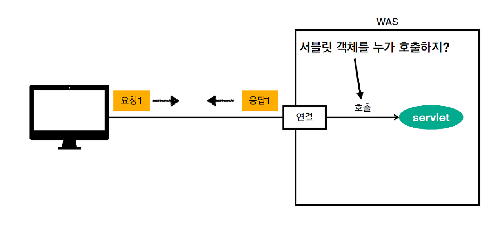
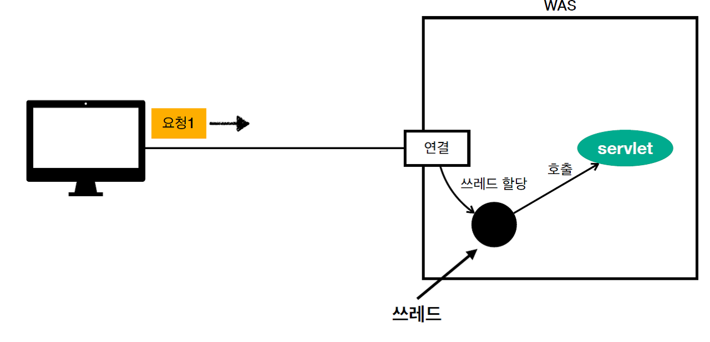
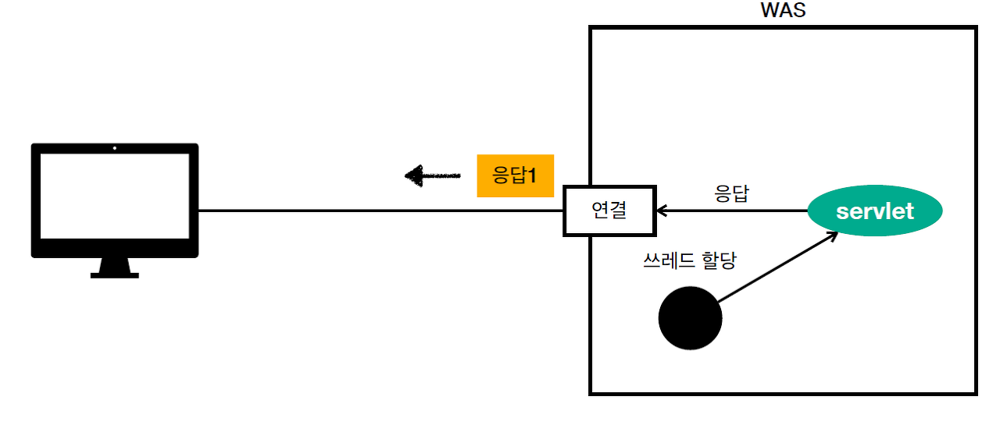
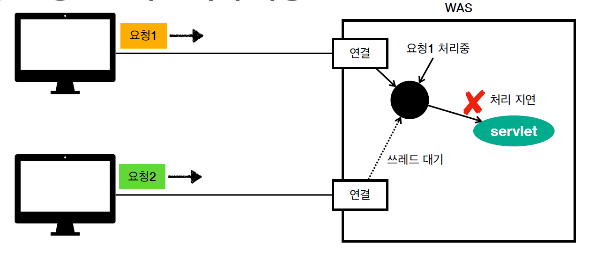
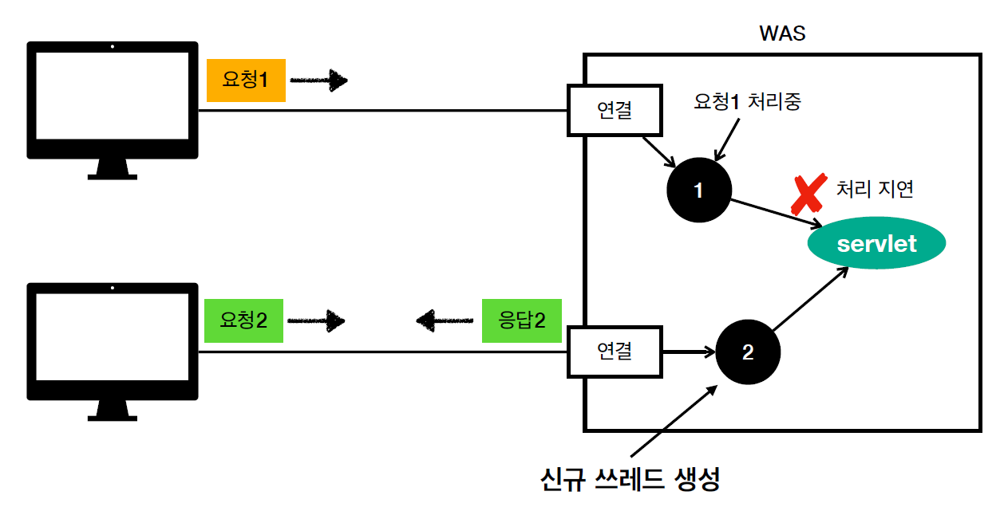
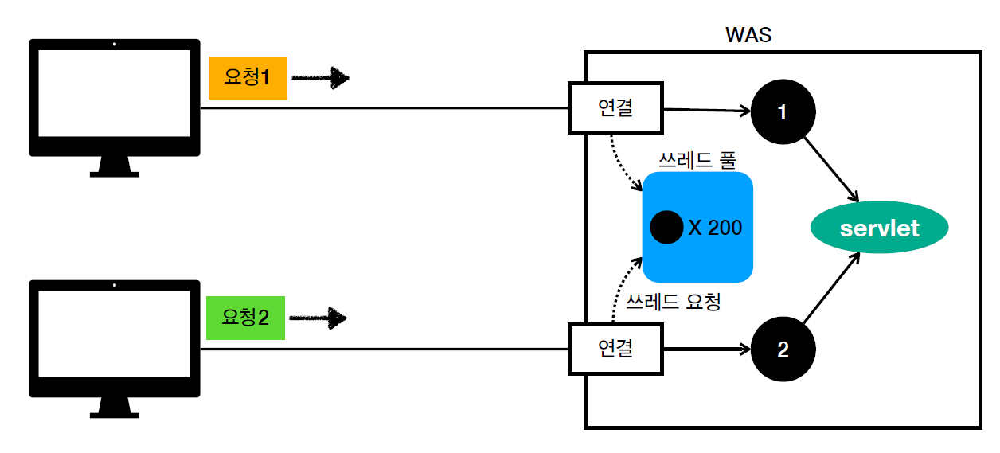

# 스프링 MVC에서의 멀티 쓰레드

## 클라이언트의 요청

- 클라이언트가 서버로 요청을 하면 WAS는 응답을 한다.
- TCP/IP 커넥션이 연결되고 서블릿이 호출된다.
  - 이 때, 서블릿은 '쓰레드'가 호출해준다.
 
## 쓰레드
- 쓰레드는 서블릿을 호출해주는 역할을 한다.
- 쓰레드는 어플리케이션 코드를 순차적으로 실행해준다.
- 자바 메인 메서드를 처음 실행하면 main이라는 이름의 쓰레드가 실행된다.
- 쓰레드가 없다면 자바 어플리케이션은 실행이 불가능하다. 왜냐하면 실행시켜주는 애가 없기 때문이다.
- 쓰레드는 한번에 하나의 코드 라인만 실행한다. 따라서 동시 처리가 필요하면 여러 쓰레드가 필요하다.
 
### 단일 요청 - 쓰레드 하나만 있을 때

- 쉬고 있는 쓰레드가 요청에 할당된다.

- 쓰레드는 서블릿 호출해서 일하고, 응답을 준다.

#### 순서
1. 클라이언트에서 서버로 요청이 온다.
2. WAS는 이 요청에 놀고 있는 쓰레드를 할당한다.
3. 쓰레드는 이 요청에 대한 서블릿을 호출한다.
4. 쓰레드는 응답을 반환해주고, 다시 휴식한다.
 
### 다중 요청 - 쓰레드 하나만 있을 때

- '요청 1'로 인해 휴식하고 있던 쓰레드는 요청 1에 할당된다.
  - '요청 1'의 쓰레드가 불의의 사건으로 서블릿에서 처리가 지연되고 있다고 가정해보자.
- 이 때 '요청 2'가 들어오면, '요청 2'는 사용 가능한 쓰레드가 없기 때문에 쓰레드를 위해 대기한다.
- 위와 같은 상황이 발생하면 쓰레드 하나만 있을 때는 어떠한 요청도 제대로 처리할 수 없다는 것을 알게 된다.
  - 요청 1은 비즈니스 로직이 느리다는 이유로 처리가 지연되고 있을 수 있고,
  - 요청 2는 요청 1이 처리될 때까지 쓸 수 있는 쓰레드가 없기 때문에 계속 기다려야 한다.

### 요청마다 쓰레드 생성

- 요청마다 쓰레드 생성은 말 그대로 요청이 올 때 마다 새로운 쓰레드를 생성해서 배정해주는 것이다.

#### 장점
- 동시 요청을 처리할 수 있음.
- 하나의 쓰레드가 지연되어도, 다른 쓰레드는 정상 동작한다.
#### 단점
- 쓰레드는 생성 비용이 매우 비싸다.
  - 매번 생성하면 응답 속도가 느려질 수 있다.
- 쓰레드는 컨텍스트 스위칭 비용이 발생한다.
  - 코어 개수만큼 CPU가 있고, CPU 개수만큼 동시에 쓰레드 처리가 가능하다.
  - 코어가 1개만 있다면 1개의 쓰레드를 실행 후, 그 다음 쓰레드로 넘어가게 되는데 이 때 컨텍스트 스위칭 비용이 발생한다.
- 쓰레드 생성에 제한이 없다.
  - 고객 요청이 한번에 많이 오면 CPU, 메모리 등의 임계점이 넘어서 다운될 수 있다.

### 쓰레드 풀 (요청마다 쓰레드 생성의 단점 극복)

- WAS는 주로 '쓰레드 풀'을 사용해서 동시 처리를 도와준다.
  - WAS에는 초기에 설정된 값만큼 쓰레드가 미리 만들어진다.
  - 그리고 요청이 올 때 마다 쓰레드 풀에서 쓰레드를 가져다 쓰고, 쓰레드 사용이 완료되면 쓰레드를 반납한다. (삭제 X)

#### 특징
- 필요한 쓰레드를 쓰레드 풀에 보관하고 관리한다.
- 쓰레드 풀에 생성 가능한 쓰레드의 최대치를 관리한다. (톰캣은 200개)
#### 사용
- 쓰레드가 필요하면, 쓰레드 풀에서 가져다 쓴다.
- 쓰레드 풀에 사용가능한 쓰레드가 없다면? 
  - 기다리는 요청을 거절하거나, 특정 숫자만큼 대기하도록 설정한다.
#### 장점
- 쓰레드가 미리 생성되어 있기 때문에 쓰레드를 생성 및 종료하는 비용이 절약되고, 응답 시간이 빠르다.
- 생성 가능한 쓰레드의 최대치를 고려해서 초기에 설정되기 때문에 요청을 안전하게 처리할 수 있다. 
 
## WAS 실무팁
- WAS의 주요 튜닝 포인트는 최대 쓰레드를 어떻게 설정할 것인지를 정하는 것이다.
- 만약 쓰레드가 너무 적다면? 
  - 동시 요청이 많으면 서버 리소스는 여유롭지만, 클라이언트는 응답이 지연된다.
  - 따라서 CPU는 5%만 사용하고 있는데, 응답 지연이 발생하고 있으니 서버가 너무 모자라구나 라는 생각을 하고 서버를 늘릴 수 있다.

- 만약 쓰레드가 너무 많다면?
  - 오히려 반대로 이 경우에는 서버가 죽을 수 있다.
  - 동시 요청이 많을 것을 가정하고 임계점 근처에 놓고 쓰게 된다면, 실제로 그렇게 많은 동시 요청이 오면 동시에 처리하다가 서버가 죽는 경우가 발생한다.
- 위의 경우를 살펴보면 적정선을 유지하는 것이 중요한 것을 볼 수 있다.
  - 만약 서버에서 응답 지연이 발생한다면, 먼저 서버를 늘려서 안전하게 잘 동작하도록 유지한다.
  - 그리고 쓰레드 개수 튜닝을 해서 최적화를 하는 방법으로 접근해야 한다. 
- 쓰레드 풀의 적정 갯수를 찾는 방법은 딱히 정해져 있지 않다.
  - 어플리케이션의 비즈니스 로직이 얼마나 복잡한지, I/O 리소스가 어떤지에 따라 상황이 모두 다르기 때문이다.
  - 보통은 최대한 실제 서비스와 유사하게 성능 테스트를 해서 결정한다.
  - 이 때 사용 가능한 툴은 아파치 ab, 제이미터, nGrinder 같은 것들이다.

## 요약
- WAS는 멀티 쓰레드를 지원해준다.
- 멀티 쓰레드에 대한 처리는 WAS가 한다 → 개발자는 멀티 쓰레드 관련 코드 신경 쓰지 않아도 됨.
- 개발자는 싱글 쓰레드 프로그래밍처럼 코드를 작성하면 됨.
- 멀티 쓰레드 환경이기 때문에 싱글톤 객체(서블릿, 스프링 빈)은 주의해서 사용해야한다.
