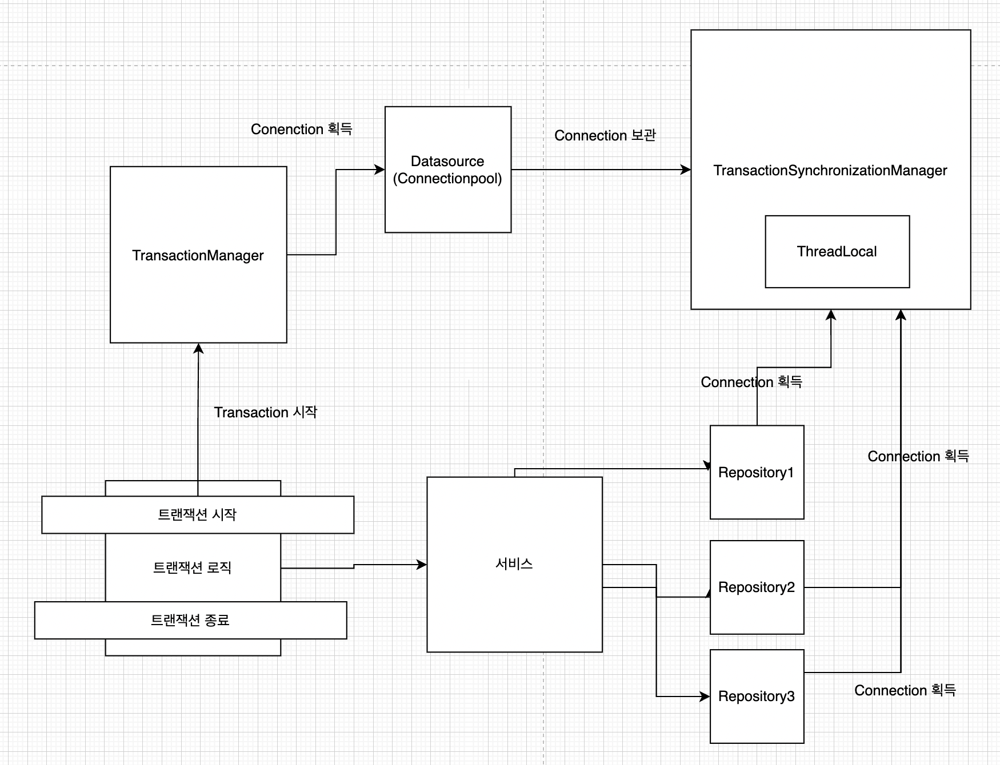

# TransactionManager란?

## 문제점
- Spring에서 사용할 수 있는 DB 접근 기술들에는 순수 JDBC, JPA, R2DBC 등의 다양한 기술들이 있다.
  - 그런데 각각의 기술들은 서로 다른 Transaction 처리 방법을 제공한다.
- 아래는 JDBC와 JPA의 차이점을 보여주는 예시이다. 

### 순수 JDBC의 Transaction

```java
Connection con = dataSource.getConnection();
try {
    con.setAutoCommit(false); // 트랜잭션 시작
    // 비즈니스 로직
    bizLogic(con, fromId, toId, money);
    con.commit(); // 성공 시 커밋
} catch (Exception e) {
    con.rollback(); // 실패 시 롤백
    throw new IllegalStateException(e);
} finally {
    release(con); // connection 릴리즈
}
```

### JPA의 Transaction

```java
EntityManager entityManager = emf.createEntityManager();
EntityTransaction transaction = entityManager.getTransaction();
transaction.begin(); // Transaction 시작

bizLogic()

transaction.commit(); // Transaction 커밋
```

- 둘을 비교했을 때 Transaction을 처리하는 코드가 다르다는 것을 확인할 수 있다.
- 만약 순수 JDBC를 사용하다가 JPA를 도입해야 한다면, 개발자는 Transaction을 사용하는 코드를 모두 수정해야 하는 매우 골치아픈 상황에 마주하게 된다.  

## 해결 방법
- 이런 상황을 객체지향적으로 해결하기 위해 Spring은 TransactionManager라는 대안을 내놓았다.

```java
public interface PlatformTransactionManager extends TransactionManager {
   TransactionStatus getTransaction(@Nullable TransactionDefinition definition)
         throws TransactionException;

   void commit(TransactionStatus status) throws TransactionException;

   void rollback(TransactionStatus status) throws TransactionException;

}
```

- 개발자는 각 기술의 특징별로 Transaction을 구현하는 것이 아니라 TransactionManager를 구현한 구현체를 주입받아 JDBC를 사용하든, JPA를 사용하든 동일한 방법으로 구현할 수 있다.
- TransactionManager 구현체는 Spring이 설정을 파악해서 자동으로 Bean으로 등록해준다.
  - JPA를 쓰면 JpaTransactionManager를, 순수 JDBC를 쓰면 DatasourceTransactionManager를 등록해준다.
  - 이외에도 다른 DB 접근 기술을 쓰면 그에 알맞은 구현체를 등록해준다.

### 실제 사용 예시 

```java
@Autowired
private TransactionManager transactionManager

// 트랜잭션 시작
TransactionStatus status = transactionManager.getTransaction(new DefaultTransactionDefinition());

try {
    // 비즈니스 로직
    bizLogic(fromId, toId, money);
    transactionManager.commit(status); // 성공 시 커밋
} catch (Exception e) {
    transactionManager.rollback(status); // 실패 시 롤백
    throw new IllegalStateException(e);
}
```

- 위와 같이 사용하면 필요에 따라 주입받은 TransactionManager가 작동하기 때문에 JPA를 쓰던, 순수 JDBC를 쓰던 동일한 코드를 사용할 수 있다.

## 동작 방식
- TransactionManager를 생각하면, Datasource와 TransactionSynchronizationManager를 기억해야 한다.

### Datasource
- Spring에서는 기본적으로 Connection Pool을 사용해서 DB Connection을 관리한다.
- Transaction도 Connection을 사용해서 이뤄지기 때문에 TransactionManager는 Datasource(Connection Pool) 참조를 가지고 있다.
  - Datasource는 ConnectionPool과 같은 말이라고 볼 수 있다. 

### TransactionSynchronizationManager
- Transaction은 Connection 단위로 이뤄지게 된다.
- 때문에 하나의 요청에 같은 Connection을 사용할 수 있도록 보장해줘야 하는데, 이 때 사용되는 것이 TransactionSynchronizationManager이다.

#### 예시
- 은행에서 송금하는 로직이 있다고 가정해보자. 단순하게 보면 아래와 같은 3번의 작업이 일어난다고 볼 수 있다.

```
1) 송금자의 은행에서 잔고 읽어오기
2) 송금자 잔고 업데이트
3) 수신자의 잔고 업데이트 
```
 
- 이 때 총 3번의 DB 접근이 일어나고 이 과정은 Atomic 해야 한다.
- 그런데 이 3번의 접근을 하나의 Connection, 즉 하나의 Transaction 이 아닌 여러 개의 Transaction으로 처리하게 된다면 예상치 못한 상황이 발생할 수 있다. 
- 이를 해결하기 위해 TransactionSynchronizationManager는 ThreadLocal에 Connection을 저장해두고 DB에 접근할 때마다 동일한 Connection을 사용할 수 있도록 보장해준다. 

### 동작 과정
<p align="center"></p>

1. Transaction 시작
2. Datasource에서 Connection 획득
3. Connection을 TransactionSynchronizationManager의 ThreadLocal에 저장
4. Repository에서 TransactionSynchronizationManager을 통해 Connection 획득 후 처리
5. 로직 수행 완료
6. Transaction commit or rollback
7. TransactionSynchronizationManager의 ThreadLocal에서 Connection 제거
8. Datasource에 Connection 반환
