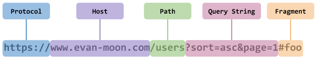
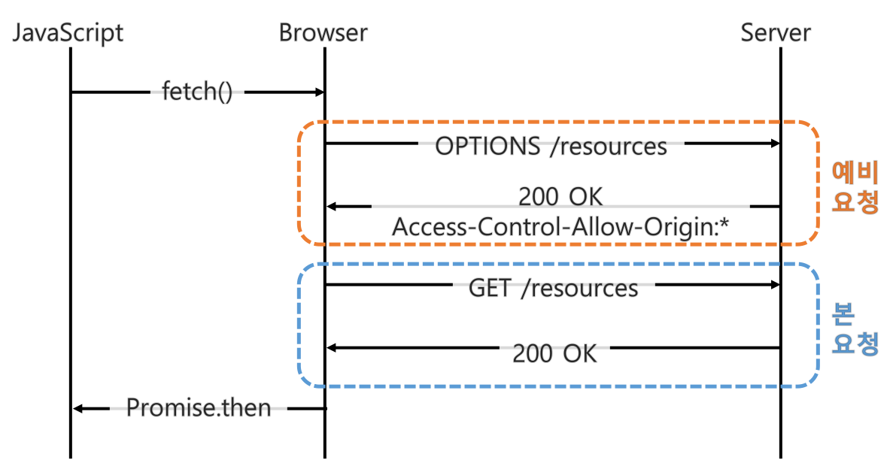
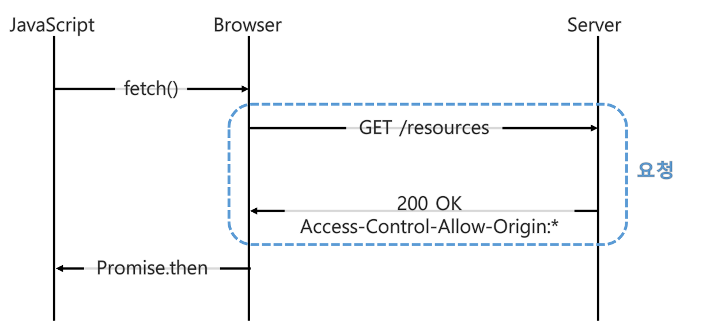
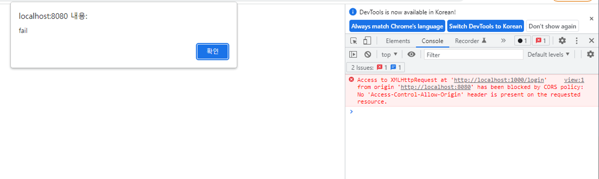

# Spring에서 CORS 이슈를 해결하는 방법
## CORS(Cross-Origin Resource Sharing)
- CORS는 Cross-Origin Resource Sharing 의 줄임말로, 교차 출처 리소스 공유를 의미한다.
  - 교차 출처는 ‘다른 출처’라고 생각하면 이해하기 쉽다.
  - 즉, 다른 출처 간의 자원을 공유하는 정책이라고 생각하면 된다.

## 출처(Origin)
- www.google.com 같은 URL은 여러 개의 구성 요소로 이루어져 있다.

<p align="center"></p>
 
- Protocol, Host, Path, Query String, Fragment 구성 요소 중 출처(Origin)는 Protocol과 Host, 그리고 :80 , :443 같은 포트 번호까지 모두 합친 것을 의미한다.
  - 즉, www.google.com:443 까지를 출처라고 생각하면 된다.
  - 참고로 HTTP는 포트 번호가 80번, HTTPS는 포트 번호가 443번으로 정해져 있어서 이 번호를 생략해도 무방하다.

## SOP(Same-Origin Policy)
- SOP는 Same-Origin Policy의 줄임말로, 단어 뜻 그대로 같은 출처만 허용한다는 정책을 의미한다.
- 과거에는 보안을 위해 엄격하게 같은 출처만 통신하도록 허용하였으나, 최근에는 다른 출처에 있는 리소스를 가져와서 사용하는 일이 아주 흔하므로 SOP의 예외 조항인 CORS 정책을 두게 되었다.

## CORS의 동작 과정
### 기본적인 흐름
- 기본적으로 웹 클라이언트 애플리케이션이 다른 출처의 리소스를 요청할 때는 HTTP 프로토콜을 사용하여 요청을 보내게 되고,
  - 이 때 브라우저는 요청 헤더에 Origin 이라는 필드에 요청을 보내는 출처를 함께 담는다.
- Origin: https://google.com 과 같이 출처를 담아서 서버로 보내면, 서버는 응답 헤더의 Access-Control-Allow-Origin이라는 값에 이 리소스를 접근하는 것이 허용된 출처 목록을 담아준다.
  - 이후 응답을 받은 브라우저는 __자신이 보냈던 요청의 Origin__ 과 __서버가 보내준 응답의 Access-Control-Allow-Origin__ 을 비교한다.
  - 만약 허용되지 않는 Origin이면 CORS 정책 위반 이슈가 발생하며, 여기서 주의할 점은 서버의 응답은 200번이 온다는 것이다. 

- 핵심 흐름은 위와 같지만, 사실 CORS가 동작하는 방식은 크게 Preflight Request, Simple Request, Credentialed Request가 있다.

### Preflight Request
- Preflight Request 방식은 일반적으로 사용하는 방식으로, 브라우저는 요청을 한 번에 보내지 않고 예비 요청과 본 요청으로 나누어서 서버로 전송한다.
- 이 때 예비 요청은 OPTIONS 메소드를 사용하여 본 요청을 보내기 전에, 브라우저 스스로 이 요청이 안전한지 확인하는 역할을 한다.

<p align="center"></p>

- JavaScript의 fetch() API를 사용하여 브라우저에게 서버의 리소스를 받아오라는 명령을 내린다.
- 브라우저는 서버에게 예비 요청을 보낸다.
- 예비 요청의 응답으로 Access-Control-Allow-Origin의 값을 확인하여, 허용하는 출처를 조회한다.
  - 브라우저 요청의 출처가 허용되지 않는다면, CORS 정책 위반 이슈가 발생한다. (이 때 응답의 상태 코드는 200번이 온다.)
  - 예비 요청의 응답이 성공하지 못하면, CORS 정책 위반 이슈가 발생한다.
- 예비 요청이 성공하면, 실제 본 요청을 보내서 서버의 리소스를 받아온다.
 
### Simple Request
- Simple Request는 예비 요청을 보내지 않고 서버에게 바로 본 요청을 보낸 후, 응답 헤더의 Access-Control-Allow-Origin 값을 확인하여 CORS 정책 위반 여부를 확인한다.

<p align="center"></p>

- 다만, 아무 때나 Simple Request를 사용할 수 있는 것은 아니고 특정 조건을 만족해야 한다.

#### 조건
1. 요청의 메소드는 GET, HEAD, POST 중 하나여야 한다.
2. Accept, Accept-Language, Content-Language, Content-Type, DPR, Downlink, Save-Data, Viewport-Width, Width를 제외한 헤더를 사용하면 안 된다.
3. 만약 Content-Type를 사용하는 경우에는 application/x-www-form-urlencoded, multipart/form-data, text/plain만 허용된다.
 
- 조건만 봐도 일반적인 웹 애플리케이션의 경우 지키기 어려워서 거의 사용되지 않는다.

## Spring에서 CORS 이슈를 해결하는 방법
- 프론트엔드(ex. React)와 백엔드(ex. Spring)로 나누어 개발할 경우 CORS 이슈는 아주 흔하게 발생한다.
- Spring을 사용하여 CORS 이슈를 해결하는 방법은 크게 3가지가 있다.

### 사전 준비
- 직접 리액트를 세팅하는 것은 번거로운 일이므로 Spring 프로젝트 내의 모듈 2개를 만들어서, 독립적인 애플리케이션을 띄워보자.
- cors-test 모듈 안에 login과 user 모듈을 만든다.
  - 이 때 전자는 카카오 소셜로그인 API와 같은 서드파티 API 서버라고 생각하고,
  - 후자는 실제로 해당 서드파티 API를 이용하는 서버라고 생각하면 된다.

#### login
```java
@RestController
public class LoginController {

    @GetMapping("/login")
    public String login() {
        return "로그인 성공! ID: jayon, PW: 1234";
    }
}
```
- 로그인 모듈 내의 LoginController 클래스를 만들고, 간단히 login() 메소드를 호출하면 로그인 성공 메시지를 띄우도록 만들었다.

```
server.port=1000
```

- 그리고 application.properties에는 포트 번호를 바꿔 주자.

#### user

```java
@Controller
public class UserController {

    @GetMapping("/api/view")
    public String view() {
        return "/cors";
    }
}
``` 

- 유저 모듈 내의 UserController 클래스를 만들고, 간단히 view() 메소드를 호출하면 cors.html을 렌더링하도록 만들었다.

```html
<!DOCTYPE html>
<html lang="en">
<head>
    <meta charset="UTF-8">
    <title>Title</title>
</head>
<body>
<script src="https://code.jquery.com/jquery-3.5.1.min.js" integrity="sha256-9/aliU8dGd2tb6OSsuzixeV4y/faTqgFtohetphbbj0=" crossorigin="anonymous"></script>
<script>
    $(function(){
        $.ajax("http://localhost:1000/login")
            .done(function(msg){
                alert(msg);
            })
            .fail(function(){
                alert("fail");
            })
    })
</script>
</body>
</html>
``` 

- cors 페이지는 타임리프를 사용하여 작성하였고, 페이지를 로딩할 때 ajax를 통해 로그인 API에 요청을 보내는 구조이다.

### 실행 결과 - cors 발생

<p align="center"></p>
 
- 프로토콜과 호스트는 동일하지만, 포트 번호가 다르므로 CORS 이슈가 발생하는 것을 확인할 수 있다.
  - 이를 해결하는 방법을 살펴보자.

### @CrossOrigin 사용
- 가장 쉬운 방법은 CORS 정책을 설정해줄 대상에 @CrossOrigin 어노테이션을 활용하는 것이다.

```java
@CrossOrigin(originPatterns = "http://localhost:8080")
@RestController
public class LoginController {

    @GetMapping("/login")
    public String login() {
        return "로그인 성공! ID: jayon, PW: 1234";
    }
}
```

- 위와 같이 로그인 모듈의 LoginController 위쪽에 해당 어노테이션을 붙이고, originPatters 속성을 통해 요청을 허용할 출처를 적어준다.

<p align="center"></p>

- CORS 이슈가 발생하지 않는 것을 확인할 수 있다.

### WebMvcConfigurer에서 설정하기
- 위 방법은 간단하지만, CORS 정책을 설정해야 할 대상이 많아지면 중복된 코드가 늘어난다.
- 따라서 글로벌하게 config 파일에서 CORS 정책을 설정하는 것이 좋다.

```java
@Configuration
public class WebConfig implements WebMvcConfigurer {

    @Override
    public void addCorsMappings(CorsRegistry registry) {
        registry.addMapping("/**")
                .allowedOrigins("http://localhost:8080")
                .allowedMethods(HttpMethod.GET.name());
    }
}
```

- WebMvcConfigurer를 상속한 클래스를 만들고, addCorsMappings() 를 재정의하면 된다.
  - addMapping() 메소드를 통해 CORS 정책을 적용할 URL 패턴을 설정하고,
  - allowedOrigins() 메소드를 통해 허용할 출처를 적어준다.
  - allowedMethods() 메소드를 통해 GET, POST와 같은 HTTP 메소드의 종류도 제한할 수 있다.

<p align="center"></p>
 
- 마찬가지로 CORS 이슈가 발생하지 않는 것을 확인할 수 있다.

### 프록시 서버 사용
- 서버단은 CORS 정책이 위반된다고 400, 500번대와 같은 상태 코드를 반환하지 않고 200번 코드를 반환한다.
- 그래서 CORS 이슈는 브라우저 단에서 서버의 Access-Control-Allow-Origin 값을 보고 방금 보낸 요청의 출처가 허용되는지 판단하고, 허용되지 않으면 발생한다고 이야기하였다.
- 즉, 요청을 보내는 쪽에서 프록시 서버를 만들어 간접적으로 전달하면 응답을 받을 수 있다.

```java
@Controller
public class UserController {

    @GetMapping("/api/view")
    public String view() {
        return "/cors";
    }

    @GetMapping("/api/proxy")
    @ResponseBody
    public String proxyView() {
        String url = "http://localhost:1000/login";

        RestTemplate restTemplate = new RestTemplate();
        return restTemplate.getForObject(url, String.class);
    }
}
```

- 그리고 localhost:8080/api/proxy 로 요청을 보내면 CORS 이슈 없이 잘 응답이 렌더링된 것을 확인할 수 있다.
- RestTemplate를 통해 서버와 서버 간 통신을 하였으므로 당연히 CORS 이슈 없이 응답 데이터를 얻어올 수 있고, 브라우저 입장에서는 요청을 보낸 출처와 응답을 받은 출처가 같으므로 응답 데이터를 정상적으로 렌더링해 주는 것이다.
  - 해당 방법은 클라이언트에서 프록시 서버를 필요로 할 때 사용하면 좋다.
