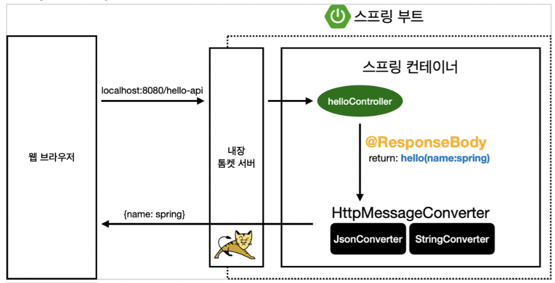
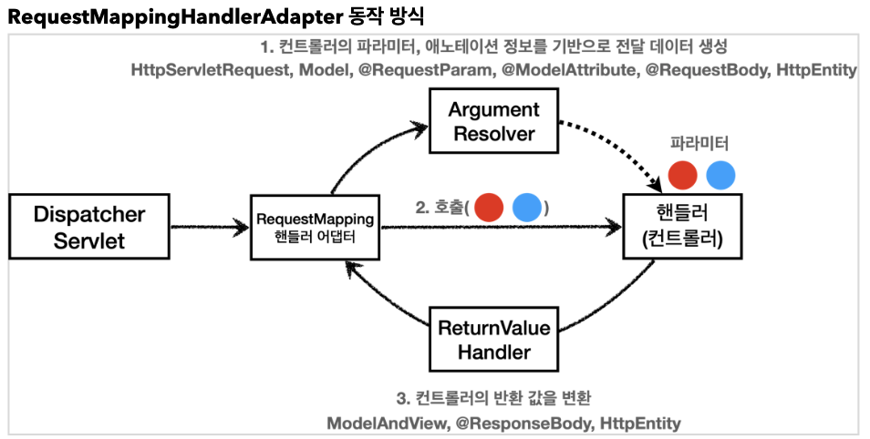
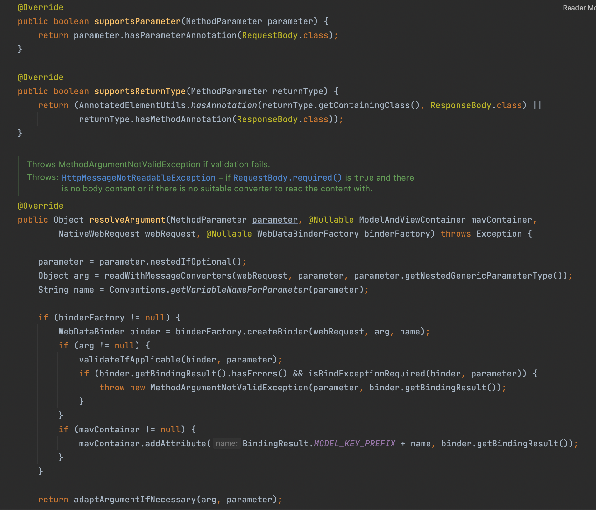
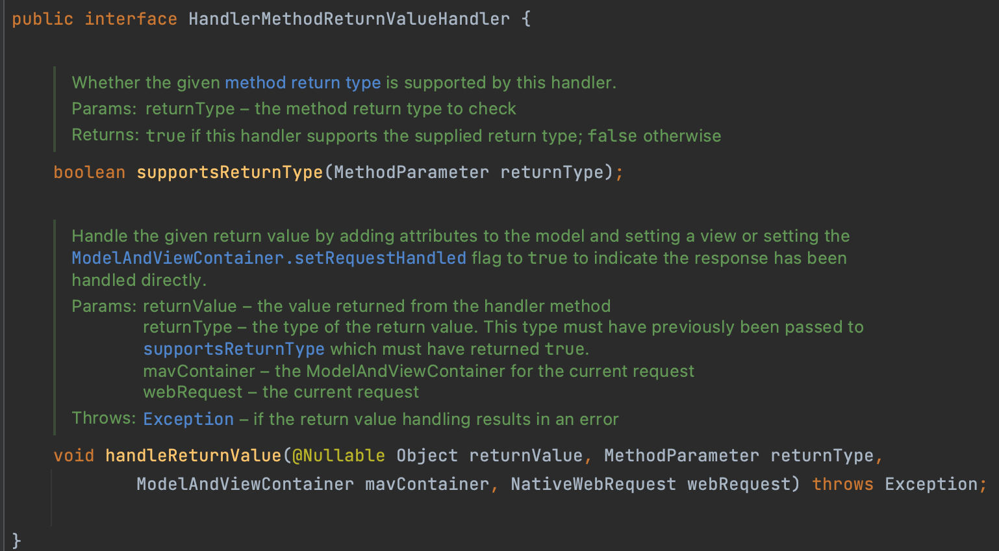

# 스프링에서의 HttpMessageConverter 적용

## 개요
- 스프링 프레임워크에서 직렬화와 역직렬화 시 메세지 컨버터를 사용하게 된다.
- 먼저 클라이언트의 요청을 반환하는 여러 예시 코드를 살펴보자.

```java
@Controller
public class RequestBodyController {

    @GetMapping("/response-body-json-v1")
    public ResponseEntity<BepozObject> responseBodyJsonV1() {
        BepozObject bepozObject = new BepozObject();
        bepozObject.setUsername("userA");
        bepozObject.setAge(20);
        return new ResponseEntity<>(bepozObject, HttpStatus.OK);
    }

    @ResponseStatus(HttpStatus.OK)
    @ResponseBody
    @GetMapping("/response-body-json-v2")
    public BepozObject responseBodyJsonV2() {
        BepozObject bepozObject = new BepozObject();
        bepozObject.setUsername("userA");
        bepozObject.setAge(20);
        return bepozObject;
    }
}
```
- 우리는 위와 같은 상황에서 객체를 JSON 형태로 바꿔주기 위해 메세지 컨버터를 사용하게 된다.

<p align="center"></p>

- 스프링 부트 내부에서는 위의 그림과 같이 돌아간다고 간략히 표현할 수 있다.
- @ResponseBody를 사용하게 되면 ViewResolver 대신 HttpMessageConverter가 동작하게 된다.
  - String과 같은 기본 문자 처리는 StringHttpMessageConverter를 이용하게 되고,
  - 객체의 경우에는 MappingJackson2HttpMessageConverter를 이용하게된다.
  - 이 외에도 여러 케이스에 맞는 컨버터들이 등록되어 있어 상황에 맞는 구현체를 사용하게 된다.

- @ResponseBody의 경우 위의 컨버터를 사용한다고 했지만 정확히는 다음과 같을 때 사용된다.
  - HTTP 요청 : @RequestBody, HttpEntity(ResponseEntity) (ResponseEntity는 HttpEntity를 상속받았음)
  - HTTP 응답 : @ResponseBody, HttpEntity(ResponseEntity)

## HttpMessageConverter의 동작 방식
```java
public interface HttpMessageConverter<T> {

    boolean canRead(Class<?> clazz, @Nullable MediaType mediaType);

    boolean canWrite(Class<?> clazz, @Nullable MediaType mediaType);

    List<MediaType> getSupportedMediaTypes();

    default List<MediaType> getSupportedMediaTypes(Class<?> clazz) {
        return (canRead(clazz, null) || canWrite(clazz, null) ?
                getSupportedMediaTypes() : Collections.emptyList());
    }

    T read(Class<? extends T> clazz, HttpInputMessage inputMessage)
            throws IOException, HttpMessageNotReadableException;

    void write(T t, @Nullable MediaType contentType, HttpOutputMessage outputMessage)
            throws IOException, HttpMessageNotWritableException;

}
```

- 간략히 설명하자면, canRead, canWrite를 통해 읽고 쓸 수 있는지에 대한 여부를 확인한다.
  - 컨버터는 요청과 응답 두 경우 모두 사용되기 때문이다.
  - 이후 read, write 메서드를 통해 읽고 쓰는 동작을 실행하게 된다.
- canRead, canWrite 메서드의 인수 타입을 보면 클래스와 미디어타입을 체크하는 것을 확인할 수가 있다.
- 대표적인 컨버터는 다음과 같다.
```
1) ByteArrayHttpMessageConverter
2) StringHttpMessageConverter
3) MappingJackson2HttpMessageConverter
  ...
// 우선순위도 앞에서부터 오름차순이다.
```

- ByteArrayHttpMessageConverter는 byte[] 데이터를 처리한다.
  - 클래스 타입은 byte[]이며 미디어 타입은 */* 이다.
- StringHttpMessageConverter는 String 문자로 데이터를 처리한다.
  - 클래스 타입은 String이며 미디어 타입은 */*이다.
- MappingJackson2HttpMessageConverter는 json 으로 데이터를 처리한다.
  - 클래스 타입은 객체 또는 HashMap이며 미디어 타입은 application/json 관련이다.

### 예시
```java
content-type : application/json

@RequestMapping
void hello(@RequestBody String data) {}
```
- 위 코드의 경우 일단 String 타입이니 ByteArrayHttpMessageConverter는 스킵되고 그 다음 컨버터인 StringHttpMessageConverter가 적합하다고 판단할 것이다.
- 그 후에 미디어 타입을 체크하게 되는데 해당 컨버터는 모든 미디어 타입을 받아들이니 이것 또한 통과되어 StringHttpMessageConverter를 사용하게 된다.

```java
content-type : application/json

@RequestMapping
void hello(@RequestBody BepozObject data) {}
```
- 위의 경우에는 객체타입이니 MappingJackson2HttpMessageConverter가 적합하다고 판단할 것이고 미디어 타입 또한 일치하므로 해당 컨버터를 사용하게 될 것이다.

```java
content-type : text/html

@RequestMapping
void hello(@RequestBody BepozObject data) {}
```
- 그렇다면 위의 코드는 어떨까? 객체이니 MappingJackson2HttpMessageConverter가 적합하다고 판단하겠지만, 미디어 타입 체크를 하는 과정에서 탈락될 것이다.
- 만약 올바른 컨버터를 찾지 못한다면 이에 대한 예외가 발생하게 된다.

---

- 위와 같이 canRead 메서드를 통해 컨버팅 여부를 확인한 후에 read 메서드를 사용해 객체를 생성 후 반환한다.
- 응답의 경우도 마찬가지로 canWrite를 통해 판단한 후 write메서드를 호출하여 HTTP 응답 메세지 바디에 데이터를 생성하게 된다.
  - 조금 다른점은 request의 경우에는 content-type의 미디어 타입을 확인했다면 response를 하는 이 경우에는 accept의 미디어 타입을 확인한다는 점이 차이가 있다.
  - (정확히는 @RequestMapping의 produces 속성)

image

스프링은 HttpMessageConverter를 구현하는 정말 많은 종류의 컨버터를 지원하는 것을 알 수가 있다.

## HttpMessageConverter의 적용 시점
<p align="center"></p>

- DispatcherServlet은 위와 같은 형태로 동작을 실행한다. (인터셉터와 예외처리를 생략한 그림)
- @RequestMapping 어노테이션이 핸들러 매핑과 핸들러 어댑터에 대한 정보를 주게되는데 컨버터는 이 핸들러 어댑터를 수행하는 과정에서 이루어진다.

<p align="center"></p>

- 어댑터에서 이 핸들러를 실행할 때에 ArgumentResolver를 이용해서 파라미터를 넘겨준다.
- 우리가 컨트롤러 메서드를 작성할 때에 사용하던 @RequestBody, Model, @ModelAttribute 등이 모두 ArgumentResolver라는 것을 통해서 생성한 후에 해당 파라미터를 넘겨준 것이다.
- 스프링 코드를 보면 메세지 컨버터와 같이 기본적으로 많은 리졸버들을 제공하고 있다는 것을 확인할 수가 있다.

### RequestResponseBodyMethodProcessor (어노테이션 확인 및 알맞은 argument 생성)
<p align="center"></p>

- 위의 코드는 RequestResponseBodyMethodProcessor의 코드이다.
- RequestBody와 ResponseBody 어노테이션이 있는지 확인하고 있는 것을 볼 수가 있고 그에 따른 argument를 생성하는 코드도 볼 수가 있다.
  - 기본적으로 제공해주는 파라미터에 대한 내용은 spring docs 에 나와있다.

### ReturnValueHandler
<p align="center"></p>

- 다음과 같은 인터페이스가 있고 이것을 구현하는 수많은 클래스들이 있다.
  - 이를 구현하는 클래스의 목록도 마찬가지로 spring-docs 에서 확인할 수가 있다.
